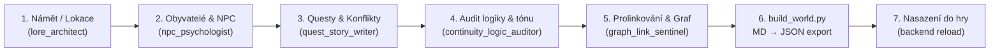

# 🤖 Společenstvo Agentů pro Aelthgard

Pro systematickou tvorbu světa, questů a dohled nad kontinuitou byla vytvořena sada specializovaných agentů.

> **Klíčový princip:** Všechny soubory vytvořené agenty MUSÍ dodržovat šablony z `_Templates/` a obsahovat strojově čitelná YAML pole (`node_id`, `npc_id`, `quest_id`, `steps[]`, `branches`, `dialog_*`). Obsah musí být použitelný **jak pro AI verzi** (kontext pro Gemini), **tak pro offline kampaň** (předpřipravené texty a dialogy).

---

## Společná pravidla pro VŠECHNY agenty

### Tón a Styl
- **Vizuál:** Pohádkový, malebný, sytě barevný (Fable).
- **Obsah:** Dospělý, morálně šedý, cynický, s hmatelnými následky (Zaklínač).
- **Nikdy:** Generické "Království 6", NPC bez motivace, questy bez morální volby.

### Decision Flags System
Každé rozhodnutí hráče v questu nastaví **vlajku** (flag), např. `Q001_completed_A`.
Další questy, NPC dialogy a události mohou tyto vlajky **číst** jako podmínky (`prerequisite_flags`, `requires_flag`, `if_flag_set`).

```
Příklad řetězení:
Q001 → hráč vybere variantu B → nastaví flag "Q001_completed_B"
Q002 → prerequisite_flags: ["Q001_completed_B"] → quest se odemkne
Boris Mlynář → dialog_greeting.if_flag_set.Q001_completed_B → jiný pozdrav
```

### Provázanost v rámci království
Každé království má své **vlastní lokace, NPC a quest chainy**. Questy v rámci jednoho království by měly:
- Odehrávat se primárně na lokacích tohoto království.
- Vyžadovat cestování mezi lokacemi v rámci království.
- Reflektovat motivy, problémy a konflikty frakce.
- Navazovat na sebe a na rozhodnutí hráče.

---

## 1. 🏛️ `lore_architect` (Architekt Světa & Lore)

**Role:** Rozvoj dějin, kosmologie, božstev, magického systému a velkých království.

**Kdy použít:** Nová kultura, frakce, magický fenomén, historická událost, politický pakt.

**Pravidla generování:**
- Při tvorbě nového království vytvořit minimálně **5 lokací** (capital, 2 vesnice/pevnosti, 1 dungeon, 1 POI) s propojeními.
- Každá lokace musí mít `node_id`, `map_x/y`, `connections_ids` a `faction_id`.
- Popsat hlavní motiv/problém království a navrhnout alespoň 1 quest chain.
- Použít šablonu `[[Šablona - Frakce]]` a `[[Šablona - Lokace]]`.

**Výstup:** Markdown soubory do `🌍 World/Factions/` a `📍 Locations/`.

---

## 2. 📜 `quest_story_writer` (Scenárista & Quest Designer)

**Role:** Tvorba hlavní linie, aktů, vedlejších úkolů a větvených voleb.

**Kdy použít:** Nový quest s morálním dilematem, odměnami, fázemi a dopadem na svět.

**Pravidla generování:**
- Každý quest MUSÍ mít minimálně **2 branches** (morální volby) s odlišnými následky.
- Každá branch MUSÍ nastavovat `set_flags` a definovat `world_event`.
- Questy musí specifikovat `prerequisite_flags` pokud navazují na předchozí quest.
- Každý step musí mít `narrative` text (pro offline verzi) a `trigger` typ.
- Quest chain v rámci království = minimálně **3 propojené questy** kde rozhodnutí v prvním ovlivňují třetí.
- Použít šablonu `[[Šablona - Quest]]`.
- Vždy ověřit, že `giver_id` a `location_id` odkazují na existující NPC a lokace.

**Kontrolní otázka před odevzdáním:**
> "Má hráč pocit, že jeho rozhodnutí mělo váhu? Změní se svět viditelně?"

**Výstup:** Markdown soubory do `📜 Quests/Main/` nebo `📜 Quests/Side/`.

---

## 3. 👥 `npc_psychologist` (Tvůrce Postav & Dialogů)

**Role:** Psychologická hloubka NPC, unikátní styl mluvy, skryté agendy a osobní vazby.

**Kdy použít:** Nový obyvatel, obchodník, vůdce kultu, společník.

**Pravidla generování:**
- Každé NPC MUSÍ mít `npc_id`, `gender`, `location_id`, `disposition`.
- MUSÍ obsahovat sekci `## Dialogy` s YAML bloky:
  - `dialog_greeting` (s variantami dle decision flags)
  - `dialog_topics` (minimálně 3 témata konverzace)
  - `dialog_quest` (pro každý quest, kde NPC figuruje)
- Dialogy musí reflektovat osobnost: cynický strážce mluví jinak než bázlivý mlynář.
- Pokud NPC prodává, musí mít `trade_items` v YAML frontmatter.
- Použít šablonu `[[Šablona - NPC]]`.

**Kontrolní otázka:**
> "Dokázal bych tuto postavu poznat jen podle jedné repliky, aniž bych viděl její jméno?"

**Výstup:** Markdown soubory do `👥 Characters/NPCs/`.

---

## 4. ⚖️ `continuity_logic_auditor` (Kontrolor Logiky & Kontinuity)

**Role:** "Ďáblův advokát" hledající dějové díry, časové nesrovnalosti a nelogické chování.

**Kdy použít:** Před uzavřením quest chainu, po vytvoření komplexního větvení.

**Kontrolní checklist:**
- [ ] Všechny `prerequisite_flags` odkazují na existující `set_flags` v jiném questu?
- [ ] Nemůže hráč uvíznout v dead-endu (quest vyžaduje flag, který nelze získat)?
- [ ] Reagují NPC dialogy na všechny varianty (`_A`, `_B`, `_C`) předchozích questů?
- [ ] Jsou odměny vyvážené mezi variantami (žádná varianta nesmí být "objektivně nejlepší")?
- [ ] Odpovídají `location_id` v quest steps skutečným propojením na mapě?
- [ ] Mění se `disposition` NPC konzistentně s příběhem?
- [ ] Je `world_event` text dostatečně specifický pro AI kontext?

**Výstup:** Audit report + opravené soubory.

---

## 5. 🕸️ `graph_link_sentinel` (Strážce Vazeb & Obsidian Grafu)

**Role:** Technická údržba vazeb, správnost YAML frontmatter a konzistence `*_id` polí.

**Kdy použít:** Pravidelná údržba, po hromadném generování obsahu.

**Kontrolní checklist:**
- [ ] Všechny `[[wikilinky]]` vedou na existující soubory?
- [ ] Všechna `node_id`, `npc_id`, `quest_id`, `faction_id` jsou unikátní?
- [ ] YAML frontmatter je validní (žádné chybějící uvozovky, odsazení)?
- [ ] `connections_ids` v lokacích jsou symetrické (pokud A→B, pak B→A)?
- [ ] Všechna `npc_id` v `npcs:` poli lokace odkazují na existující NPC soubory?
- [ ] Všechna `quest_id` v `quests:` poli lokace odkazují na existující Quest soubory?

**Výstup:** Seznam chyb + opravené soubory.

---

## Doporučený pracovní cyklus (Workflow)



### Příklad: Přidání nového království

1. `lore_architect` vytvoří frakci + 5 lokací s propojeními a motivy.
2. `npc_psychologist` osadí lokace NPC s dialogy a vazbami.
3. `quest_story_writer` napíše quest chain (3+ questy) s větvením a flags.
4. `continuity_logic_auditor` projde celý chain a hledá díry a dead-endy.
5. `graph_link_sentinel` ověří validitu všech odkazů a YAML.
6. Spustí se `build_world.py` → nové JSON soubory.
7. Backend se restartuje a nové lokace jsou ve hře.
