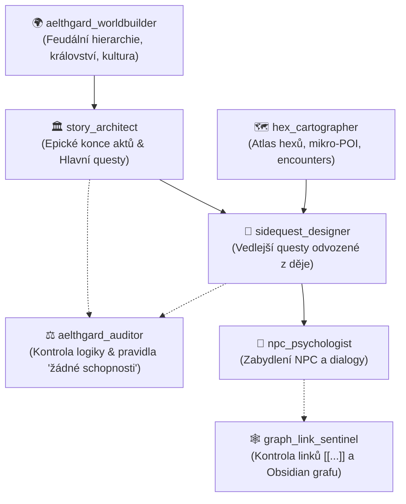

# 🤖 Společenstvo Agentů pro Aelthgard & Metodika Tvorby

---

## 🎯 Zlatá Pravidla Tvorby (Povinná pro všechny agenty)

### 1. Top-Down Postup při psaní
Děj a svět tvoříme striktně v následující hierarchii:
1. **Epický závěr Aktu (Climax & Hook):** Nejdříve musí být jasně definován monumentální zlom na konci aktu (krize, radikální změna lokace, cliffhanger a napínavé otevření cesty do dalšího aktu).
2. **Páteřní řetězec Hlavních Questů (Main Quests):** K tomuto vyvrcholení navrhujeme řetězec hlavních questů (Q001 ➔ Q002 ➔ Q003 ➔ Q004), kde každý krok stupňuje sázky.
3. **Navázané Vedlejší Questy (Side Quests):** Z důsledků, příprav a vedlejších větví hlavních questů organicky odvozujeme vedlejší úkoly.
4. **Zabydlení Lokací (NPC & POI):** Teprve když je ukotvena questová páteř, doplňujeme do lokací další obyvatele (kovář, hostinský, bylinkářka), kteří mají k těmto událostem konkrétní vztah.

### 2. Pravidlo Odměn: ŽÁDNÉ Hráčské Schopnosti
- **ZÁKAZ** udělovat hráči v questech magické schopnosti, skilly, kouzla, pasivní aury apod.
- Hráč získává **VÝHRADNĚ fyzické klíčové předměty, relikvie a artefakty** (např. *Stínový pečetní kámen*, *Annin klíč*, *Aetheritové jádro* v olověné schráně), s nimiž se bude dále manipulovat v budoucích hlavních i vedlejších questech (odemčení prastarých bran, aktivace strojů, magnet na nepřátelské frakce).

---

### 3. Kodex Živoucího a Doložitelného Světa (Living World Standard)
Aby svět působil organicky, uvěřitelně a neměl žádná "hluchá či nudná místa", musí každý agent dodržovat:
- **Žádné prázdné hexy/oblasti:** Každý sektor na mapě má terénní dominantu (Environmental Storytelling), zdroj obživy či surovin a tabulku náhodných dynamických střetnutí (viz např. [[Atlas_Udoli_Oakhaven]]).
- **Feudální a ekonomická logika:** Každá vesnice má svého pána, vrchnost, odvody desátků a důvod existence (obživa, voda, obchodní trasa).
- **Lidová víra a kultura:** Náboženství se projevuje v každodenním životě – pověry, pořekadla, rituály při pečení chleba, tabu a lidové slavnosti (viz [[Religion]]).
- **Doložitelnost v Obsidianu:** Každá zmíněná postava, rod, hrad či událost musí mít v trezoru svůj kotevní záznam a obousměrný odkaz [[...]].

---

## 👥 Specializovaní Agenti

### 1. 🌍 `aelthgard_worldbuilder` (Architekt Světa & Geopolitiky)
- **Zaměření:** Rozšiřování království, provincií, šlechtických rodů (např. [[Rod Falkenů - Páni Pohraničí]]), ekonomiky, církevních schizmat a lidové kultury.
- **Pravidlo:** Vše musí mít logický důvod existence, historický kontext a propojení s aktuálním dějem.

### 2. 🗺️ `hex_cartographer` (Regionální Kartograf & Detailista)
- **Zaměření:** Eliminace hluchých míst na mapě. Tvorba hexových atlasů, mikro-POI, surovinových nalezišť a dynamických střetnutí.
- **Pravidlo:** Každý krok hráče po mapě musí vyvolávat atmosféru a nabízet příležitost k interakci.

### 3. 🏛️ `story_architect` (Hlavní Příběhový Architekt)
- **Zaměření:** Epická vyvrcholení aktů, dramatické můstky (hooks) do dalších aktů, návrhy páteřních hlavních questů.
- **Pravidlo:** Striktní zákaz schopností pro hráče, soustředění na klíčové artefakty a celosvětové sázky.

### 4. 📜 `sidequest_designer` (Specialista na Vedlejší Úkoly)
- **Zaměření:** Tvorba vedlejších questů, které organicky vyrůstají z následků hlavních úkolů (reakce měšťanů, pašeráci, záchranné práce, klanové kontrakty).
- **Pravidlo:** Odměnou jsou předměty, suroviny, reputace nebo klíče k dalším lokacím.

### 5. 👥 `npc_psychologist` (Tvůrce Postav & Obyvatel)
- **Zaměření:** Psychologie postav, styl mluvy, skryté agendy a osobní motivace v návaznosti na probíhající krizi v údolí.

### 6. ⚖️ `aelthgard_auditor` (Dozorčí Auditor Logiky & Pravidel)
- **Zaměření:** Dohlíží na dodržování pravidla "žádné schopnosti", hlídá kauzalitu shora dolů, ověřuje, že všechny získané předměty mají budoucí smysl.

### 7. 🕸️ `graph_link_sentinel` (Strážce Vazeb & Obsidian Grafu)
- **Zaměření:** Kontrola mrtvých wikilinků `[[...]]`, správnost YAML frontmatteru a prolinkování v rámci trezoru.
