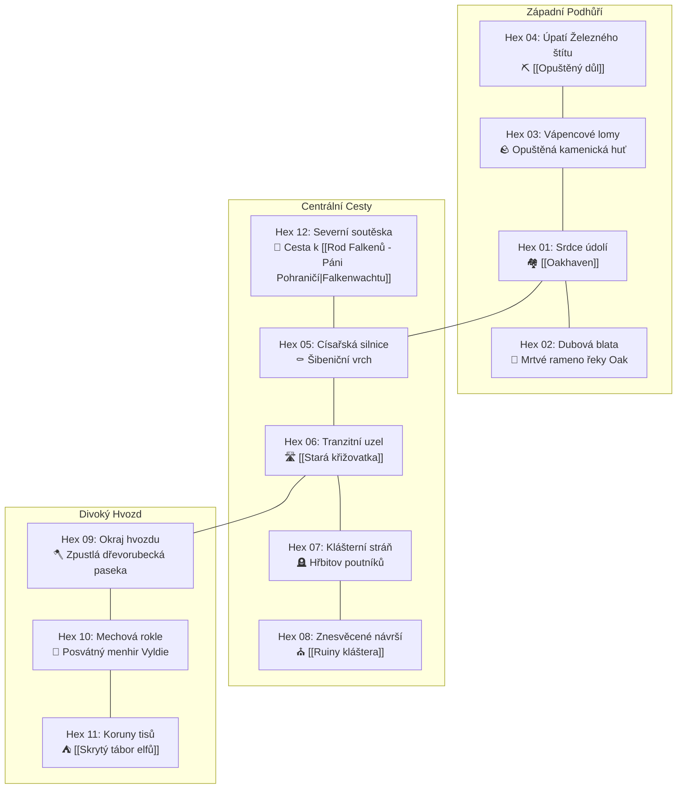

# 🗺️ Atlas Údolí Oakhaven (Hexová Síť Bez Hluchých Míst)

Tento atlas rozděluje výchozí oblast do **12 plně osazených mapových hexů**. Žádný sektor není generický ani prázdný – každý hex disponuje vlastní terénní dominantou (Environmental Storytelling), sběrnými surovinami a tabulkou dynamických náhodných střetnutí.

---

## Detailní Přehled Všech 12 Hexů

### 📍 HEX 01: Srdce údolí (Oakhaven & Předměstská pole)
- **Dominanta (Micro-POI):** Opevněné městečko [[Oakhaven]], [[Starý mlýn]] a vodní hráz.
- **Suroviny & Aktivity:** Sběr heřmánku na loukách, nákup u [[Kovář Torben|Torbena]], nocleh v [[Hostinec U Zlomeného štítu]].
- **🗝️ Skrytý loot & Tajemství:**
  - *Dutina pod podlahou mlýna:* Ocelová truhlička s Anniným prstenem a knihou modliteb ([[Q001_ZtrazenýPrsten]]).
  - *V kořenech vrby za náhonem:* Zakopaný 30litrový soudek staré žitné pálenky z roku krupobití (tip od [[Sedlák Barnabáš|Barnabáše]]).
  - *Pod prasečím korytem na severním statku:* Aetheritový mezník a okovaná schránka s dědovou jezdeckou šavlí a 30 zlaťáky ([[Q108_PraseciOsviceni]]).
  - *Podkrovní archiv radnice:* Tajná smlouva markraběte Leopolda se syndikátem a odpalovací diagram dolu ([[Q008_PredvecerKatastrofy]]).
- **Náhodná střetnutí (Encounter Table):**
  1. *Opilý sedlák na žebřiňáku:* Zasekl se mu vůz v příkopu, za pomoc dá ošatku čerstvých jablek.
  2. *Hlídka městské gardy:* Podezíravě kontroluje cizince, zda nemají na kůži stopy krystalické nákazy.
  3. *Uprchlá slepice s kradeným šperkem:* Poberta Borisova souseda ji honí po dvoře.

---

### 📍 HEX 02: Dubová blata & Mrtvé rameno řeky Oak
- **Dominanta (Micro-POI):** *Rybářská chýše u Černého rákosí* – napůl zatopený vor starého rybáře [[Porybný Gorman|Gormana]].
- **Suroviny & Aktivity:** Rybolov (okouni a úhoři), sběr leknínových oddenků, rýžování stop stříbrného písku.
- **🗝️ Skrytý loot & Tajemství:**
  - *Potopený pašerácký člun u třetí vrby:* Železná truhlička na řetězu pod kořeny (2 dýky z Nového Přístavu, lahve trnkovice a 15 stříbrňáků – tip od Gormana).
  - *Tůň Staré Bahnice:* Potopená jezdecká brašna císařského kurýra (3 leštěné jablečné jantary a 25 císařských grošů – zakázka [[B002_StaraBahnice]]).
  - *Žaludek Starého Fousáče:* Gormanův rodinný stříbrný pečetní prsten a mosazná přezka ([[Q106_PytlakZBlat]]).
- **Náhodná střetnutí:**
  1. *Roj obřích bahenních komárů:* Způsobují horečku, pokud hráč nemá bylinný odpuzovač od Míry.
  2. *Potopený pašerácký člun:* Truhla s láhvemi lihu přivázaná k vrbovým kořenům.
  3. *Utopenec zachycený v síti:* Gorman pláče nad tělem cizího kupce; u těla je císařský měšec.

---

### 📍 HEX 03: Vápencové lomy & Kamenická huť
- **Dominanta (Micro-POI):** *Zřícená jeřábová věž* – monumentální dřevěný jeřáb nad bílým lomem, kde se lámal kámen pro stavbu hradeb.
- **Suroviny & Aktivity:** Těžba křemence a vápence, hledání zkamenělin trilobitů, sběr divokého tymiánu na skalách.
- **🗝️ Skrytý loot & Tajemství:**
  - *Podlahová skrýš pod vápencovou deskou v kamenické huti:* Lamačská křemenná truhla (4 ocelové ingoty Železného Prahu, drahokam horského křišťálu a obří žulová palice se skobami – tip od [[Lovec Jarek|Jarka]] a zakázka [[B003_SkalniDrvostep]]).
- **Náhodná střetnutí:**
  1. *Hnízdo skalních harpyjí:* Tři mrchožrouti hodující na mrtvé ovci na římse lomu.
  2. *Zraněný lamač kamene:* Uvízl pod spadlým balvanem; za vyproštění dá hráči kalené dláto.
  3. *Krystalická puklina:* Ze skály vyvěrá modrý kouř Aetheritu, rostou tu křehké modré geody.

---

### 📍 HEX 04: Úpatí Železného štítu & Opuštěný důl
- **Dominanta (Micro-POI):** Vstup do [[Opuštěný důl]] – zabedněný portál s varovnými nápisy a haldy zčernalé strusky.
- **Suroviny & Aktivity:** Těžba železné rudy ze zbytků hlušiny, hledání vyhozených důlních lamp.
- **🗝️ Skrytý loot & Tajemství:**
  - *Trezor kovářů v 2. patře dolu:* Kovaná olověná schrána Železného Prahu (vyžaduje mosazný klíč v [[Q007_ZtracenaKomora]]).
  - *Strojovna parní pumpy v 1. patře:* Montážní páčidlo, manometr a dóza grafitového mazadla.
  - *Hrobka pěti tovaryšů za závalem:* Cechovní známky a brašna se 40 stříbrňáky ([[Q104_PosledniZasilka]]).
- **Náhodná střetnutí:**
  1. *Zmutovaný důlní troglodyt:* Slepý humanoid s ostrým sluchem číhající u větrací šachty.
  2. *Dezertér z cechu Železného Prahu:* Hledá v haldách zapomenutou brašnu s nářadím.
  3. *Náhlý podzemní otřes:* Půda pod nohama se propadne o půl metru, odhalí starou kostru s krumpáčem.

---

### 📍 HEX 05: Císařská silnice & Šibeniční vrch
- **Dominanta (Micro-POI):** *Šibeniční pahorek* – staré popraviště na návrší u dlážděné silnice s třemi rezavými klecemi.
- **Suroviny & Aktivity:** Sběr vraního oka a bolehlavu, čtení zrezivělých císařských vyhlášek rodu [[Rod Falkenů - Páni Pohraničí|Falkenů]].
- **Náhodná střetnutí:**
  1. *Potulný mnich řádu Solariana:* Fanaticky bičuje své tělo a věští pád Oakhaven v ohni.
  2. *Převrácený vůz s jídlem:* Hladoví uprchlíci se perou o rozsypané pytle s moukou.
  3. *Tři zběhové z armády:* Pokusí se hráče obrat o boty a plášť, dají se zastrašit zbraní.

---

### 📍 HEX 06: Tranzitní uzel (Stará křižovatka)
- **Dominanta (Micro-POI):** [[Stará křižovatka]] – prastarý Solarianův obelisk a vypálená stanice mýtnice (viz [[Q102_KrysiPevnost]]).
- **Suroviny & Aktivity:** Obchod s překupníky v koutě mýtnice, zajišťování stop po karavaně ([[Q003_ZlomenaPrisaha]]).
- **🗝️ Skrytý loot & Tajemství:**
  - *Zazděná schránka v krbu mýtnice:* Císařská pokladnička s 20 stříbrňáky a achátovým pečetidlem (tip od [[Učenec Fabian|Fabiana]] v [[Q107_OperenyZlodej]]).
  - *Mrtvá schránka pod patou obelisku:* Kódovaný deník a mosazný klíč k prachárně ([[Q003_ZlomenaPrisaha]]).
  - *Šibeniční klec na jilmu:* Fabianův ztracený terénní deník v hnízdě krkavce Zobáka.
  - *Kořeny šibeničního jilmu:* Hliněný džbánek s 12 měděnými mincemi hlídaný zmijí.
- **Náhodná střetnutí:**
  1. *Kupecký vůz s polámanou nápravou:* Kupec nabízí slevu výměnou za opravu nářadím z kovárny.
  2. *Smečka mrchožroutských psů:* Trhají těla koní po přepadení.
  3. *Tajemný posel z Nového Přístavu:* Hledá kontakt na překupníky [[Svobodná města]].

---

### 📍 HEX 07: Klášterní stráň & Hřbitov poutníků
- **Dominanta (Micro-POI):** *Kaplička Tří slzí* – omšelá kamenná svatyňka u cesty, kde poutníci zanechávali měděné mince za šťastný návrat.
- **Suroviny & Aktivity:** Vykopávání starých hrobů (pokud má hráč lopatu), sběr šalvěje lékařské a hřbitovního mechu.
- **Náhodná střetnutí:**
  1. *Přízračná mlha za soumraku:* Snižuje viditelnost a z hrobů se ozývá tichý pláč.
  2. *Vykrádač hrobů:* Přistižen s rýčem u krypty; prosí o milost a nabízí stříbrný svícen.
  3. *Kostlivec se zrezivělým mečem:* Pozůstatek znesvěceného řádu z [[Ruiny kláštera]].

---

### 📍 HEX 08: Znesvěcené návrší (Ruiny kláštera)
- **Dominanta (Micro-POI):** [[Ruiny kláštera]] sv. Judity – vyhořelé gotické oblouky, propadlá chrámová loď a vchod do krypty.
- **Suroviny & Aktivity:** Hledání posvěceného stříbra, páčení ohořelých relikviářů, průzkum krypty ([[Q002_SepotKrypty]]).
- **🗝️ Skrytý loot & Tajemství:**
  - *Zazděný relikviář pod zvonicí:* Za zborcenou gotickou nikou stříbrný kalich se sluncem a pergamenná liturgie (tip od [[Učenec Fabian|Fabiana]]).
  - *Popeliště ve skriptoriu:* Masivní stříbrný kalamář a zuhelnatělý zlomek *Knihy stínových pečetí*.
  - *Krypta svaté Judity:* Olověná schránka s rituálním svícnem a *Anniným kódovaným deníkem* ([[Q002_SepotKrypty]]).
- **Náhodná střetnutí:**
  1. *Stínový fantom:* Bytost utkaná z černého kouře reagující na světlo pochodně.
  2. *Kultista Malakara na útěku:* Zraněný fanatik boha [[Religion#Kull|Kulla]] s kacířským pergamenem.
  3. *Inkviziční průzkumník:* Akolyta [[Inkvizitor Kaelen|Kaelena]] zaznamenávající runy na zdi.

---

### 📍 HEX 09: Okraj hvozdu & Zpustlá dřevorubecká paseka
- **Dominanta (Micro-POI):** *Opuštěná pila a skladiště klád* – hromady zpráchnivělých kmenů a rozbitý vodní hamr.
- **Suroviny & Aktivity:** Těžba kvalitního dubového dřeva, sběr smůly a hub (choroše na troud).
- **🗝️ Skrytý loot & Tajemství:**
  - *Vyvrácený kmen dubu:* Gobliní úkryt s pytlem kradeného kovářského nářadí, měšcem se 14 stříbrňáky a armádní loveckou dýkou ([[Q101_GobliniFarma]]).
- **Náhodná střetnutí:**
  1. *Past na medvědy:* Skrytá pod listím; pokud hráč nedává pozor, zraní mu nohu.
  2. *Gobliní záškodník:* Schovává se v dutém pařezu s ukradeným pytlem nářadí (napojení na [[Q101_GobliniFarma]]).
  3. *Výstražné znamení elfů:* Na větvi visí zvířecí lebka probodnutá šípem – varování před vstupem do hvozdu.

---

### 📍 HEX 10: Mechová rokle & Posvátný menhir
- **Dominanta (Micro-POI):** *Posvátný menhir Vyldie* – sedm stop vysoký žulový kámen ovinutý liánami a prastarými runami (viz [[Q105_ZnesvecenyHaj]]).
- **Suroviny & Aktivity:** Sběr stříbřitého lišejníku pro Míru ([[Q103_LeceniBariery]]), posvátné jmelí, léčivá pramenitá voda.
- **🗝️ Skrytý loot & Tajemství:**
  - *Kořeny pod menhirem:* V dutině pod runovým kamenem je ukrytá obětní bronzová dýka klanů a lahvička posvátné pryskyřice Vyldie (tip od [[Učenec Fabian|Fabiana]] a [[Q105_ZnesvecenyHaj]]).
- **Náhodná střetnutí:**
  1. *Krystalem nakažený lesní kanec:* Zuřivá bestie s krunýřem z modrého aetheritu.
  2. *Zbloudilý lovec z Oakhaven:* Bojí se pohnout kvůli klanovým šípům zabodnutým kolem jeho nohou.
  3. *Duch padlého šamana:* Zjeví se u menhiru a šeptá varování před výbuchem v dole.

---

### 📍 HEX 11: Koruny tisů (Skrytý tábor elfů)
- **Dominanta (Micro-POI):** [[Skrytý tábor elfů]] – provazové mosty, vyhlídkové plošiny v korunách pětisetletých tisů.
- **Suroviny & Aktivity:** Nákup luků a tisové kůry u [[Šamanka Sylwen|Šamanky Sylwen]], rituální očista těla.
- **🗝️ Skrytý loot & Tajemství:**
  - *Dutina ve kmeni stromu Pratisa:* Rituální studánka s kapkami křišťálové rosy odhalující stínové iluze.
- **Náhodná střetnutí:**
  1. *Elfí stopař zkoušející reflexy:* Vystřelí šíp těsně k hráčově uchu, aby otestoval jeho klid.
  2. *Léčení zraněného lesního vlka:* Mladá elfka ošetřuje vlče poraněné ocelovou pastí z Oakhaven.
  3. *Pozorovatelna hvozdu:* Elfí strážce pozoruje kouř stoupající z komínů [[Kovář Torben|Torbenovy kovárny]].

---

### 📍 HEX 12: Severní soutěska & Cesta na Falkenwacht
- **Dominanta (Micro-POI):** *Zborcený říšský viadukt* – starobylý kamenný most přes hlubokou rokli, střežený pevnou císařskou závorou.
- **Suroviny & Aktivity:** Hledání starých říšských mincí v suti, výhled na vzdálené vrcholky hor s hradem Falkenwacht.
- **🗝️ Skrytý loot & Tajemství:**
  - *Skalní doupě pod Čertovým zubem:* Krystalická vlčí lebka Tesáka a roztrhaná brašna kurýra s 15 groši (zakázka [[B001_KrystalickyTesak]]).
- **Náhodná střetnutí:**
  1. *Císařští celníci rodu Falkenů:* Vyžadují mýto 10 zlaťáků za průjezd na sever (lze obejít glejtem z [[Q004_PecetAPlamen]]).
  2. *Spěchající kurýr na zpoceném koni:* Nese Leopoldovi zprávu o povstání horníků, odmítá zastavit.
  3. *Skupina uprchlíků z Karanténní Zóny:* Vyhublí lidé v hadrech směřující na jih, žebrají o kůrku chleba.
