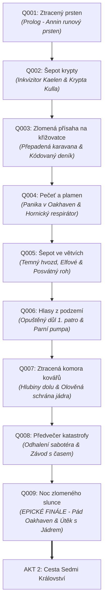

# Akt 1: Stíny nad Oakhavenem

> **Vize Aktu 1:** Začíná jako komorní venkovská detektivka v zapadlém koutě pohraničí, postupně eskaluje v náboženský a politický teror, odhaluje rozsáhlé těžařské spiknutí v podzemí a vrcholí kataklyzmatickým pádem údolí, který hráče s vzácným artefaktem katapultuje do vysoké politiky Sedmi království.

---

## 💥 EPICKÝ ZÁVĚR AKTU 1 (CLIMAX & HOOK)

### Finální Quest: [[Q009_NocZlomenehoSlunce|Q009 – Noc zlomeného slunce]]
- **Krize:** Podzemní Aetheritová žíla v [[Opuštěný důl]] po sabotáži a narušení pečetí exploduje. Vypukne zemětřesení, protrhne se hráz u [[Starý mlýn]] a probudí se *Aetheritový kolos* (prastará dvanáctimetrová mechanicko-krystalická těžařská konstrukce).
- **Útok na město:** Zdivočelá zvířata a troglodyti zaplavují ulice, Oakhaven hoří, [[Strážmistr Aldric]] brání barikády.
- **Finální volba hráče:**
  - **Volba A (Odpálení tunelů):** Odpálení přístupových tunelů pomocí trhavin – kolos je zavalen, město zčásti uchráněno, ale horníci zůstanou navždy pohřbeni.
  - **Volba B (Vyrvání Jádra):** Hráč riskuje život a vytrhne **Aetheritové jádro** do olověné schrány – kolos padne, ale tlaková vlna smete městské hradby a vyžádá si evakuaci.
  - **Volba C (Pakt s Hvozdem):** Použití posvátného rohu z elfího tábora – les pohltí město i kolosa a navrátí údolí přírodě.

### Napínavý Můstek (Hook) do Aktu 2: *Štvanice Sedmi království*
- Starý svět Oakhaven skončil. Hráč drží v rukou **Aetheritové jádro** v olověné schráně Železného Prahu (fyzický artefakt, zdroj nesmírné energie a klíč k prastarým technologiím; hráči nedává magické spelly).
- Na [[Stará křižovatka]] dorazily armády tří mocností:
  - Fanatická křížová výprava [[Teokracie Solariova]]
  - Těžkooděnci [[Valerijské Impérium]]
  - Žoldnéři syndikátu [[Svobodná města]]
- Všichni jdou po stopě artefaktu. Jediná cesta do bezpečí vede neprobádanými hvozdy na otevřený kontinent. **Začíná Akt 2.**

---

## ⛓️ PÁTEŘNÍ ŘETĚZEC 9 HLAVNÍCH QUESTŮ (MAIN QUEST SPINE)

### Přehled fází a klíčových předmětů:
1. **[[Q001_ZtrazenýPrsten]] (Prolog):** Hledání Borisova snubního prstenu. Odhalení kacířské runy Kulla a Annina původu z [[Tajemné Útočiště]].  
   *Klíčový předmět:* *Annin prsten s runou Kulla*.
2. **[[Q002_SepotKrypty]] (Eskalace & Inkvizice):** Příchod [[Inkvizitor Kaelen]], vyšetřování v [[Ruiny kláštera]], odhalení Stínového pečetního kamene a Annina deníku.  
   *Klíčový předmět:* *Stínový pečetní kámen v olověném pouzdře* / *Solarianův amulet*.
3. **[[Q003_ZlomenaPrisaha]] (Eskalace na křižovatce):** Zmasakrovaná císařská kolona na [[Stará křižovatka]], zmutovaní krystaloví vlci.  
   *Klíčový předmět:* *Kódovaný deník důlního dozorce* a *Mosazný klíč k prachárně*.
4. **[[Q004_PecetAPlamen]] (Městská krize):** Panika a pokus o lynč v [[Oakhaven]], střet mezi radou a inkvizicí, zisk úředního glejtu.  
   *Klíčový předmět:* *Císařská vyšetřovací pečeť* a *Hornický respirátor Železného Prahu*.
5. **[[Q005_SepotVeVetvich]] (Průzkum hvozdu):** Průnik do [[Temný hvozd]], navázání kontaktu s [[Skrytý tábor elfů]], šamanka Sylwen a tajemství tří pečetí.  
   *Klíčový předmět:* *Vyřezávaný roh z posvátného tisu* a *Lesní pryskyřičná mast*.
6. **[[Q006_HlasyZPodzemi]] (Vstup do dolu):** Průzkum 1. patra [[Opuštěný důl]], oprava parní pumpy, záchrana uvězněné hlídky stráže.  
   *Klíčový předmět:* *Páka parního výtahu* a *Geologický kompas Železného Prahu*.
7. **[[Q007_ZtracenaKomora]] (Hlubiny a kovářská dílna):** Sjezd do 2. a 3. patra, tajná svatyně cechu [[Železný Práh]], porážka krystalického berserkra.  
   *Klíčový předmět:* *Kovaná olověná schrána Železného Prahu* a *Mechanický klíč 'Sluneční ozub'*.
8. **[[Q008_PredvecerKatastrofy]] (Odhalení spiknutí):** Vystopování sabotéra v Oakhaven, který pracoval pro cizí syndikát. Otřesy půdy, zpožděná záchrana a spuštění odpočtu.  
   *Klíčový předmět:* *Odpalovací diagram dolu* a *Klíč od tajné únikové branky*.
9. **[[Q009_NocZlomenehoSlunce]] (Epické finále):** Masivní výbuch žíly, probuzení Aetheritového kolosa, boj na barikádách v Oakhaven, trojí finální volba a zisk *Aetheritového jádra*.

---

## 🌿 PROSTOR PRO NÁVAZNÉ VEDLEJŠÍ QUESTY
Každý z hlavních úkolů otevírá konkrétní vedlejší větev:
- Po **Q001/Q002**: [[Q101_GobliniFarma]] (vyhnání goblinů z polí), `Q102_KrysiPevnost` (pašeráci na křižovatce).
- Po **Q004/Q005**: `Q103_LeceniBariery` (pomoc bylinkářce s přípravou obvazů pro popálené měšťany).
- Po **Q006/Q007**: `Q104_PosledniZasilka` (vynesení rodinných památek zavalených horníků).

---

## 👥 ZABYDLENÍ LOKACÍ (NPC & POI)
K této páteři budou následně přiřazena specifická NPC s osobními motivacemi:
- Místní kovář (opravy pumpy a respirátoru)
- Hostinský (drby o sabotérovi a podezřelých kupcích)
- Šamanka v elfím táboře (duchovní výklad koloběhu)
