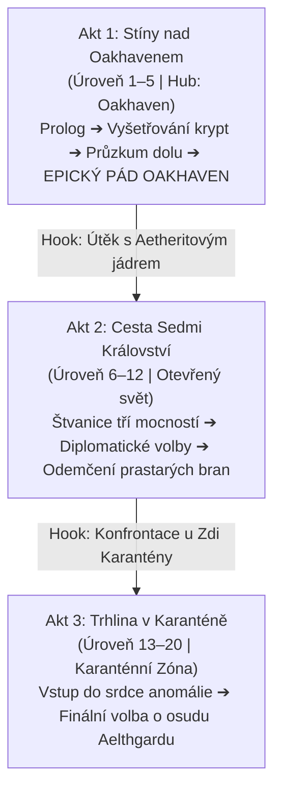

# Hlavní Dějová Linie Aelthgardu

## Ústřední Premisa
Hráč začíná jako zdánlivě bezvýznamný tulák v odlehlém pohraničním městečku [[Oakhaven]]. Postupně se však zaplétá do tajemství prastarých pečetí, krystalického Aetheritu a skrytých Probuzených. Hráč **nedisponuje žádnými magickými schopnostmi**, ale v průběhu příběhu získává a ovládá unikátní fyzické relikvie a klíčové artefakty, které z něj činí nejhledanější postavu kontinentu.

Tři bohové a Sedm království sledují jeho kroky:
- [[Religion#Solarian|Solarian]] – Církev chce artefakt roztavit a očistit svět svatým ohněm.
- [[Religion#Vyldia|Vyldia]] – Příroda touží po návratu surového chaosu a pohlcení lidských pevností.
- [[Religion#Kull|Kull]] – Bůh stínů šeptá skrze relikvie a nabízí moc tomu, kdo dokáže ovládat tajemství.

---

## Přehled Aktů

### [[Act1_Oakhaven|Akt 1: Stíny nad Oakhavenem]] (Úroveň 1–5)
- **Ohnisko:** Region Oakhaven (6 mapových uzlů).
- **Zápletka:** Ztracený prsten mlynářovy ženy odhaluje spící síť Probuzených a stínový kult. Protržení pečetí probouzí hlubiny v [[Opuštěný důl]].
- **Epický klimax:** Prolomení Aetheritové žíly, probuzení Aetheritového kolosa a bitva o přežití Oakhaven.
- **Hook do Aktu 2:** Oakhaven padá nebo je nevratně poškozeno. Hráč uniká do divočiny se vzácným artefaktem (*Aetheritové jádro*), v patách má armády Impéria i křížovou výpravu Inkvizice.

### Akt 2: Cesta Sedmi Království (Úroveň 6–12)
- **Ohnisko:** Kontinentální cesty, hranice [[Valerijské Impérium]], kovářské pevnosti [[Železný Práh]], přístavy [[Svobodná města]] a lesy [[Kmeny z hvozdů]].
- **Zápletka:** Hráč je lovnou zvěří. Aby porozuměl moci artefaktu a ochránil se, musí najít spojence mezi frakcemi a navštívit kovářské mistry i tajné učence z [[Tajemné Útočiště]].

### Akt 3: Trhlina v Karanténě (Úroveň 13–20)
- **Ohnisko:** Opevněná zeď a vnitřek [[Karanténní Zóna]].
- **Zápletka:** Všechny stopy a relikvie vedou k epicentru prapůvodní katastrofy. Finální střet o to, zda bude svět znovu očištěn, pohlcen divočinou, nebo uvržen do věčných stínů.
