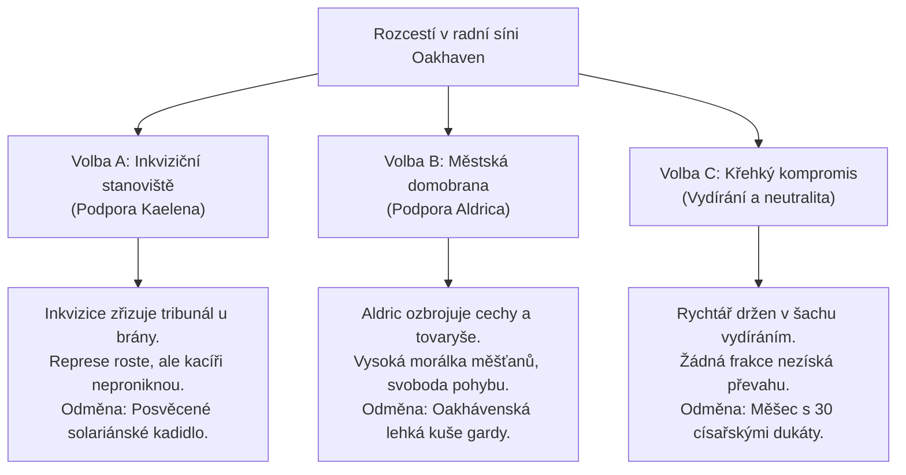

# Q004 – Pečeť a plamen

> *"Když se měšťané začnou bát víc svého souseda než zimy a hladu, město nepotřebuje nepřátele za hradbami. Sežehne se samo zevnitř. Stačí jediná jiskra, jedno křivé nařčení a z poctivých ševců a pekařů se stanou krvežíznivé bestie s pochodněmi."*  
> — [[Strážmistr Aldric]], stojící na schodech radnice s taseným mečem

---

## Přehled úkolu
Zprávy o krvavém masakru na [[Stará křižovatka|Staré křižovatce]] a krystalem znetvořených vlcích ([[Q003_ZlomenaPrisaha]]) se roznesly po [[Oakhaven]] jako morová rána. Městečko upadlo do hysterické paniky. Rolníci a vystrašení měšťané, povzbuzení kázáním fanatického mnicha z doprovodu [[Inkvizitor Kaelen|Inkvizitora Kaelena]], se shromáždili na náměstí u Pařezu Pradubu. Chtějí obětního beránka.

Dav s pochodněmi a vidlemi obklíčil [[Bylinkářská chýše u palisády|chýši Bylinkářky Míry]], kterou obviňují ze spiknutí s čarodějnicemi z [[Temný hvozd]] a z otravy studny.
Mezitím se v patře [[Městská radnice a archiv|radnice]] odehrává zuřivá hádka za zavřenými dveřmi:
- **[[Inkvizitor Kaelen]]** požaduje okamžité vyhlášení stanného práva, zapečetění bran městečka, postavení kacířského kůlu a plnou pravomoc nad výslechy obyvatel.
- **[[Strážmistr Aldric]]** ví, že uvěznění lidí za palisádou bez zásob povede k hladomoru, vzpouře a zkáze. Požaduje posílení hlídek a vyšetření původu nákazy v dolech.
- **[[Rychtář Vane]]** se třese strachy o svůj život i úřad a odmítá vydat císařské svolení k čemukoliv, dokud nedostane záruky od lenního pána [[Rod Falkenů - Páni Pohraničí|Leopolda von Falken]].

Hráč musí v této výbušné situaci zabránit krveprolití na náměstí, vstoupit do radní síně, předložit důkazy získané na křižovatce a získat **Císařskou vyšetřovací pečeť** a **Hornický respirátor Železného Prahu**, bez nichž je nemožné proniknout k zamořenému podzemí v [[Opuštěný důl]].

---

## Zúčastněné postavy & mocenské zájmy
- **Obránce řádu:** [[Strážmistr Aldric]] – snaží se udržet klid zbraní, ochránit Míru před lynčem a získat pro hráče legální pravomoci k vyšetřování.
- **Kladivo víry:** [[Inkvizitor Kaelen]] – využívá paniku k nastolení teokratického teroru a chce zabavit veškeré důkazy o stínové magii pro sebe.
- **Vyděšený byrokrat:** [[Rychtář Vane]] – drží v rukou císařské pečetidlo, ale je vydíratelný dopisy o zpronevěře pohraničních daní.
- **Hromosvod hněvu:** [[Bylinkářka Míra]] – nevinná felčarka, která léčí chudé, ale v očích pověrčivého davu je podezřelá čarodějnice.
- **Trpasličí spojenec:** [[Kovář Torben]] – jediný, kdo rozumí nebezpečí důlních plynů v šachtách a vlastní technické nákresy respirátoru.
- **Místní podněcovatel:** Pacholek Gero – opilý dřevorubec vedoucí dav s pochodněmi, jehož bratr zahynul na křižovatce.

---

## Fáze úkolu (Quest Steps)

```yaml
steps:
  - id: 1
    objective: "Spěchej na náměstí v Oakhaven a zabraň lynčování Bylinkářky Míry"
    location_id: "oakhaven"
    trigger: "location_arrival"
    narrative: |
      Náměstí hučí hněvem. Kolem kvetoucí zahrádky Bylinkářky Míry u palisády stojí kruh třiceti vesničanů s pochodněmi, kovanými cepy a sekerami. V čele křičí pacholek Gero: 'Pálí v chatrči koření a mluví s lesem! Kvůli ní vlci roztrhali karavanu!'
      Míra je zabarikádovaná uvnitř, z okenice trčí zapíchnutá sekera. Dva mladí městští gardisté ustupují a bojí se tasit meče proti vlastním sousedům.
    on_complete_flag: "Q004_step1_mob_confronted"

  - id: 2
    objective: "Utiš nebo rozežeň rozvášněný dav před chýší"
    location_id: "oakhaven"
    trigger: "dialogue_choice:mob_resolution"
    narrative: |
      Hráč má tři cesty, jak krizi vyřešit:
      a) Výmluvnost & Důkazy: Ukázat krystalický tesák z alfa vlka (z Q003) a dokázat, že šelmy přišly z hlubin země, nikoliv z Mířina kotlíku.
      b) Zastrašení & Síla: Srazit Gera k zemi úderem jílcem do brady a pohrozit davu okamžitou odvetou městské stráže.
      c) Podplacení & Úskok: Poslat dav pít 'na účet rychtáře' do Hostince U Zlomeného štítu příslibem volného sudu piva (stojí 15 zlatých).
    on_complete_flag: "Q004_step2_mob_dispersed"

  - id: 3
    objective: "Vstup do Městské radnice a předlož důkazy na zasedání rady"
    location_id: "oakhaven_townhall"
    trigger: "interact_npc:rychtar_vane"
    narrative: |
      V klenuté zasedací síni radnice je vzduch hustý kouřem ze svící a křikem. Aldric buší pěstí do stolu, Kaelen chladně cituje sluneční klatby a rychtář Vane si tře zpocené čelo kapesníkem se špinavou krajkou.
      Hráč předkládá kódovaný deník a zprávu o přepadení kolony. Atmosféra v síni okamžitě ztuhne: všichni pochopí, že nejde o náhodný útok zvěře, ale o kolaps v podzemí.
    on_complete_flag: "Q004_step3_council_entered"

  - id: 4
    objective: "Vyjednej vydání Císařské vyšetřovací pečeti od Rychtáře Vanea"
    location_id: "oakhaven_townhall"
    trigger: "dialogue_choice:vane_negotiation"
    narrative: |
      Vane odmítá podepsat dekret umožňující vstup do těžební zóny: 'Když tam někoho pošlu bez rozkazu z Falkenwachtu, markrabě mě dá stáhnout z kůže!'
      Hráč musí najít páku:
      - Cesta diplomacie: Přesvědčit Vanea, že pokud důl nevyčistí včas, markrabě nedostane stříbro a popraví ho za nesplnění kvót.
      - Cesta vydírání: Využít záznamy z podzemního archivu radnice odhalující Vaneovy tajné odvody peněz lichvářům ze Svobodných měst.
      - Cesta inkvizičního nátlaku: Nechat Kaelena pohrozit Vaneovi obviněním z krytí kacířství.
    on_complete_flag: "Q004_step4_seal_obtained"

  - id: 5
    objective: "Získej v kovárně u Torbena ochranný Hornický respirátor Železného Prahu"
    location_id: "oakhaven_forge"
    trigger: "interact_npc:kovar_torben"
    narrative: |
      Torben zkoumá mosazný klíč získaný na křižovatce a pokyvuje vousatou bradou: 'Můj bratr v dole věděl, co dělá. Zapečetil sklad dřív, než plyn z anomálie zaplavil šachty. Ale bez masky tam nevydržíš ani pět minut – plíce by ti zkameněly krystaly.'
      Torben sestaví z měděného plechu, aktivního uhlí a sušené máty od Míry funkční těžký respirátor.
    on_complete_flag: "Q004_step5_respirator_ready"

  - id: 6
    objective: "Učiň zásadní volbu: Kdo převezme kontrolu nad obranou a právem v Oakhaven?"
    location_id: "oakhaven"
    trigger: "moral_choice:oakhaven_fate"
    narrative: |
      Před branami radnice čeká Aldric i Kaelen na konečné rozhodnutí o správě města v době nouze. Hráčovo slovo před městskou radou určí osud celého údolí v Aktu 1.
    on_complete_flag: "Q004_step6_choice_made"
```

---

## ⚖️ Zásadní Morální Volba a Její Následky

Hráč musí rozhodnout, komu rada svěří pravomoci v době stanného práva:



### Podrobný rozbor voleb:

#### ☀️ Volba A: Inkviziční stanoviště (Spravedlnost ohněm)
* **Rozhodnutí:** Hráč podpoří Kaelena a prohlásí, že situaci může zvládnout pouze nekompromisní církevní autorita.
* **Okamžitý dopad:** Kaelenovi biřici obsadí městské brány. Každý pocestný je podrobován výslechu se slunečním zrcadlem. U pranýře je postaven kacířský kůl.
* **Dlouhodobé následky pro Akt 1:** 
  - V městečku klesne kriminalita na nulu, ale roste tichý odpor.
  - V úkolu [[Q008_PredvecerKatastrofy]] a [[Q009_NocZlomenehoSlunce]] stojí po boku hráče oddíl těžce obrněných templářů s obouručními meči.
  - Vztah s lesními elfy v [[Q005_SepotVeVetvich]] je podstatně obtížnější (elfové inkvizici hluboce nenávidí).
* **Speciální odměna:** *Posvěcené solariánské kadidlo* (při použití v boji oslepí a zpomalí stínové nestvůry na 3 kola).

#### 🛡️ Volba B: Městská domobrana (Svoboda za cenu krve)
* **Rozhodnutí:** Hráč se postaví za Aldrica a argumentuje, že místní lidé mají právo bránit své domovy sami bez církevních okovů.
* **Okamžitý dopad:** Kaelen je nucen stáhnout své mnichy do farní kaple u hřbitova. Aldric a Torben začnou na náměstí rozdávat zbraně řemeslníkům a stavět barikády.
* **Dlouhodobé následky pro Akt 1:**
  - Atmosféra v městečku je plná odhodlání a solidarity. Míra může bezpečně dál léčit raněné.
  - Ve finále [[Q009_NocZlomenehoSlunce]] brání hradby desítky odhodlaných občanů Oakhaven.
  - Inkvizitor Kaelen však začne proti hráči intrikovat a v budoucnu pošle hlášení do hlavního města, což hráči přitíží v Aktu 2.
* **Speciální odměna:** *Oakhávenská lehká kuše* (rychlá palná zbraň s bonusem proti zvěři a mutantům) + 20 kalených šipek od Torbena.

#### ⚖️ Volba C: Křehký kompromis (Cynická rovnováha)
* **Rozhodnutí:** Hráč předloží kompromitující materiály na Vanea v soukromí, vynutí si glejt i klíče, ale odmítne veřejně podpořit jak Kaelena, tak Aldrica.
* **Okamžitý dopad:** Rada se rozejde v patové situaci. Ani jedna frakce nezíská monopol na moc. Vane potají podepíše všechny propustky, aby si zachránil krk.
* **Dlouhodobé následky pro Akt 1:**
  - Obě strany jsou nuceny jednat v opatrnosti a vyčkávat.
  - Hráč si zachová neutrální pověst u obou táborů, což usnadní vyjednávání jak s elfy v [[Q005_SepotVeVetvich]], tak s církví.
* **Speciální odměna:** *Měšec s 30 císařskými dukáty* (úplatek od Vanea za mlčení) + *Vaneův tajný lenní glejt*.

---

## 💬 Ukázky Klíčových Dialogů

### 1. Konfrontace s davem na náměstí (Pacholek Gero & Míra)
> **Gero (třese pochodní před Mířinými dveřmi):**  
> *"Uhni z cesty, cizinče! Tahle bába sbírá kořeny za půlnoci a šeptá do větví! Můj brácha leží na křižovatce s roztrhaným břichem a z ran mu leze modrej led! To ona na nás poštvala ty lesní zrůdy!"*  
> 
> **Možnosti hráče:**
> 1. *(Diplomacie & Důkaz)* „Podívej se na tenhle tesák, Gero. Vytrhl jsem ho z tlamy bestie, která zabíjela na křižovatce. Je z čistého krystalu ze starých štol Železného štítu. Míra zachránila tvoji matku před zápalem plic. Chceš upálit jedinou felčarku v údolí, až tě zítra kousne nakažený vlk?“ *(Hod na Charisma / Důkaz z Q003)*
> 2. *(Zastrašení)* „Udělej ještě jeden krok k těm dveřím s tím ohněm a zlomím ti obě ruce tak, že v životě neudržíš ani sekeru. Rozejděte se, než Aldric pošle stráže s nabitými kušemi!“ *(Hod na Sílu / Reputaci)*
> 3. *(Úplatný úskok)* „Gero, tvůj hněv je spravedlivý, ale obracíš ho špatným směrem. Rychtář Vane právě v krčmě narazil sud starého piva a peče skopové pro všechny chlapy z pily. Jděte se napít, já zatím bábu vyslechnu sám.“ *(Platba 15 zlatých)*

---

### 2. Spor v radní síni (Aldric vs. Kaelen vs. Vane)
> **Inkvizitor Kaelen (chladně shlíží na mapu):**  
> *"Nemáme čas na maloměstské sentimenty, strážmistře. Zlo z hlubin proniklo do těl zvěře. Pokud okamžitě neuzavřeme brány, nenařídíme půst a nepostavíme vyšetřovací hranici na náměstí, nákaza zachvátí celou provincii. Solarian žádá oběť čistoty!"*  
> 
> **Strážmistr Aldric (červený vzteky):**  
> *"Vy nevidíte nic než kacíře a hranice, Kaelene! Zavřete brány a do týdne tu lidé začnou jíst potkany a podřezávat se kvůli kůrce chleba! Potřebujeme posílit palisádu, rozdat chlapům oštěpy a poslat někoho schopného do starých štol zjistit, co se tam probudilo!"*  
> 
> **Rychtář Vane (koktá a tře si čelo):**  
> *"Pánové... prosím... ztište hlasy, lidé pod okny křičí... Co když se to dozví markrabě Leopold? Kdo zaplatí škody na daních?!"*

---

## 🎒 Získané Klíčové Předměty (Fyzické Artefakty)

V souladu s pravidly světa hráč **nezískává žádné magické schopnosti**, ale čistě hmotné nástroje nutné pro přežití v dalším postupu:

1. 📜 **Císařská vyšetřovací pečeť (Imperial Inquest Seal):**
   - Těžký pergamen se zlatou šňůrou a červenou voskovou pečetí s orlicí Valerijského Impéria a podpisem rychtáře Vanea.
   - **Využití:** Umožňuje hráči legálně projít skrz zátarasy městské gardy na západní cestě k dolu a odemyká dialogy s úředníky a vojáky.
2. 🤿 **Hornický respirátor Železného Prahu:**
   - Měděná maska s koženým upínáním na týl, osazená dvojitým filtrem z drceného dřevěného uhlí a šalvějové vaty napuštěné borovým olejem.
   - **Využití:** Nezbytná výstroj pro [[Q006_HlasyZPodzemi]]. Bez této masky hráč v podzemních štolách zamořených Aetheritovým prachem ztrácí každé kolo životy a podléhá halucinacím.
3. 🗝️ **Klíč od městské prachárny:**
   - Masivní železný klíč od skladiště pod severní baštou, umožňující hráči doplnit zásoby šipek, pochodní a zápalného oleje.

---

## 🔗 Návaznost na další úkoly v Aktu 1
- Odemčeno: [[Q005_SepotVeVetvich]] (Výprava do Temného hvozdu pro posvátný roh elfů k ochraně údolí).
- Odemčeno: [[Q006_HlasyZPodzemi]] (První fárání do podzemí Opuštěného dolu za použití respirátoru a císařské pečeti).
- Aktualizován stav v: [[Act1_Oakhaven|Akt 1: Údolí Oakhaven]] a [[Atlas_Udoli_Oakhaven|Atlas údolí Oakhaven]].
