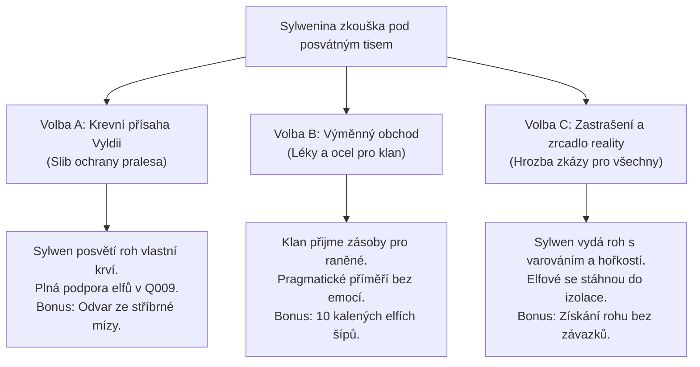

# Q005 – Šepot ve větvích

> *"Vy lidé kopete do břicha země jako nenasytní červi a pak se divíte, když se les začne třást a stromy krvácí. Ta nemoc v dolech není boží trest z nebes. Je to hnis z rány, kterou jste sami otevřeli svou pýchou a krumpáči."*  
> — [[Šamanka Sylwen]], na vyhlídkové plošině posvátného tisu Pratisa

---

## Přehled úkolu
Po uklidnění nepokojů v Oakhaven ([[Q004_PecetAPlamen]]) se ukazuje, že nákaza z hlubin proniká stále dál. Krystalické aetheritové záření neotravuje pouze spodní vody a horníky v šachtách, ale skrze kořenový systém napadlo samotný [[Temný hvozd]]. Staleté duby roní jedovatou azurovou pryskyřici, lesní zvěř podléhá zuřivosti a kmeny lesního lidu z [[Kmeny z hvozdů]] se stahují k válečnému střetu, přesvědčeni, že lidé z údolí porušili starodávný mír.

[[Bylinkářka Míra]], vděčná hráči za záchranu před rozvášněným davem, mu svěří tajemství:
Před padesáti lety byla aetheritová anomálie v dolech spoutána rituálem *Tří kořenů*. K jejímu bezpečnému opětovnému zapečetění je nezbytný rituální předmět – **Vyřezávaný roh z posvátného tisu**, který opatruje duchovní vůdkyně klanu, [[Šamanka Sylwen]], v korunách [[Skrytý tábor elfů|Skrytého tábora elfů]].

Cesta však není snadná: Hvozd se brání vetřelcům živými kořeny, v bažinách číhají zmutovaní predátoři a elfí hraničáři střílejí z větví bez varování na každého, kdo u sebe nese neposvěcené valerijské železo.

---

## Zúčastněné postavy & vazby
- **Průvodkyně & Rádkyně:** [[Bylinkářka Míra]] – dá hráči ochrannou bylinnou směs na zamaskování pachu lidského železa a radu, jak najít *Pěšinu mlčení*.
- **Strážkyně paměti hvozdu:** [[Šamanka Sylwen]] – hrdá, nedůvěřivá elfka, která si pamatuje vyhnání svého lidu valerijskými legiemi.
- **Hraničářský předák:** Kaelenis – velitel elfích lučištníků v korunách stromů, připravený zastřelit kohokoliv s tasenou čepelí.
- **Lesní přízrak / Monstrum:** *Zkrystalizovaný roháč* – prastarý mohutný medvěd znetvořený prorůstajícími modrými trny Aetheritu.
- **Dotčené lokace:** [[Oakhaven]], [[Temný hvozd]], [[Skrytý tábor elfů]].

---

## Fáze úkolu (Quest Steps)

```yaml
steps:
  - id: 1
    objective: "Vyzvedni si u Bylinkářky Míry lesní maskovací mast a radu k cestě"
    location_id: "oakhaven_herbalist"
    trigger: "interact_npc:bylinkarka_mira"
    narrative: |
      Míra maže hráčovy boty a pochvu zbraně páchnoucím borovicovým dehtem smíchaným s kozlíkem:
      'Hvozd cítí pach kovaného železa na míli daleko. Jdi po jižní stezce od Staré křižovatky. Až uvidíš vyvrácený kmen se třemi zářezy ve tvaru sovího oka, odboč na Pěšinu mlčení. A pamatuj – v lese nikdy netas zbraň první.'
    on_complete_flag: "Q005_step1_mira_consulted"

  - id: 2
    objective: "Vstup do Temného hvozdu a najdi Pěšinu mlčení"
    location_id: "dark_forest"
    trigger: "location_arrival"
    narrative: |
      Pod korunami stromů padá těžké zelené šero. Vzduch je ledový a tichý. Z mechového podrostu vyčnívají zkroucené kořeny a na kmenech starých habrů svítí modravé kapky aetheritové mízy.
      Hráč nachází padlý kmen 'Vyvráceného krále'. Za ním začíná úzká pěšina lemovaná maskami z březové kůry zavěšenými na větvích.
    on_complete_flag: "Q005_step2_path_found"

  - id: 3
    objective: "Poraz nebo uklidni zmutovaného lesního medvěda (Zkrystalizovaný roháč)"
    location_id: "dark_forest"
    trigger: "combat_or_skill_encounter"
    narrative: |
      Z houští u koryta potoka vyrazí monstrózní šelma. Prorostlé krystaly na lebce jí oslepily jedno oko a ze zad se jí kouří modrý opar bolesti.
      Hráč má dvě možnosti:
      a) Boj na život a na smrt: Využít oheň a těžké údery k rozbití krystalických plátů na jeho těle.
      b) Použití Mířina odvaru a klidný ústup: Hodit zvířeti návnadu z uspávacích bylin a pomocí dovednosti přežití se stáhnout bez krveprolití (udělá velký dojem na sledující elfy).
    on_complete_flag: "Q005_step3_beast_resolved"

  - id: 4
    objective: "Slož zbraně před elfí hlídkou a nech se vyvést do Skrytého tábora"
    location_id: "dark_forest"
    trigger: "interact_npc:kaelenis"
    narrative: |
      Z korun stromů se snese tucet šípů s černým opeřením zabodnutých do hlíny pouhý palec od hráčových nohou. Z větví seskočí lučištníci v pláštích z lišejníku.
      Pokud hráč netasil zbraň nebo ušetřil medvěda, velitel Kaelenis skloní luk: 'Viděli jsme tvůj krok, cizinče. Matka Hvozd tě nezabila, takže tě vyslechne naše šamanka. Polož meč a vystoupej po žebříku.'
    on_complete_flag: "Q005_step4_escorted_to_canopy"

  - id: 5
    objective: "Předstup před Šamanku Sylwen u posvátného tisu Pratisa"
    location_id: "elf_camp"
    trigger: "interact_npc:samanka_sylwen"
    narrative: |
      Vysoko ve větvích na obrovské dřevěné plošině hoří rituální oheň ze smrkových šišek. Sylwen zkoumá stříbrný prsten po nebožce Anně nebo pečeť z Oakhaven.
      'Anna byla moudrá žena, i když si vybrala život mezi vámi, lidmi z kamene. Věděla, že žíla pod horou spí jen do chvíle, než ji probudí lidská chamtivost. Nyní se hroutí všechny tři pečetě. Chceš-li náš posvátný roh, musíš prokázat, že ho nepoužiješ k vykování nových okovů pro můj lid.'
    on_complete_flag: "Q005_step5_sylwen_dialogue"

  - id: 6
    objective: "Vyřeš Sylweninu zkoušku a získej Vyřezávaný roh z posvátného tisu"
    location_id: "elf_camp"
    trigger: "moral_choice:sylwen_trial"
    narrative: |
      Sylwen žádá slib krve nebo oběť za předání posvátné relikvie.
    on_complete_flag: "Q005_step6_horn_obtained"
```

---

## ⚖️ Zkouška Hvozdu a Zásadní Volba

Šamanka Sylwen odmítá vydat posvátnou relikvii cizinci jen tak. Předloží hráči tři podmínky a cesty:



### Podrobný rozbor možností:

#### 🌿 Volba A: Krevní přísaha Vyldii (Pouto se zeleným lidem)
* **Rozhodnutí:** Hráč poklekne k doutnajícímu ohništi a složí přísahu, že po uklidnění žíly v dole nepřipustí další těžbu v kořenech hvozdu a zabrání kácení posvátných hájů Falkeny.
* **Následky:**
  - Šamanka Sylwen hráče přijme jako *Přítele hvozdu*.
  - V úkolu [[Q105_ZnesvecenyHaj]] získá hráč přímou asistenci zkušeného elfího stopaře.
  - V epickém finále [[Q009_NocZlomenehoSlunce]] přijdou elfí lučištníci z větví na pomoc obráncům Oakhaven (odemčena unikátní obranná taktika).
* **Odměna navíc:** *Lahvička Slz Matky Hvozdu* (plně obnoví zdraví a odstraní všechny negativní stavy).

#### ⚖️ Volba B: Výměnný obchod (Poctivá smlouva)
* **Rozhodnutí:** Hráč argumentuje věcně: Oakhaven má kováře Torbena a bylinkářku Míru. Nabídne klanu dodávky léků proti horečce a kvalitní kované nářadí výměnou za zapůjčení rohu k záchraně společného údolí.
* **Následky:**
  - Sylwen uzná hráčovu čestnost a přímočarost. Vztahy zůstávají korektní a obchodní.
  - Obyvatelé Oakhaven nebudou vázáni žádným závazkem k zákazu těžby dřeva.
* **Odměna navíc:** *10 kalených elfích šípů s tisy* (ignorují zbroj nepřítele).

#### 💀 Volba C: Zrcadlo kruté reality (Cynické procitnutí)
* **Rozhodnutí:** Hráč Sylwen nekompromisně vysvětlí: Pokud padne Oakhaven pod náporem aetheritových nestvůr, hvozd padne hned po něm. Buď jim roh vydá hned, nebo všichni shoří v modrém plameni.
* **Následky:**
  - Sylwen vidí v hráčových očích neúprosnou pravdu: *"Máš v srdci chlad císařských legií, ale nemluvíš lži."*
  - Roh hráči vydá, ale klan se stáhne hlouběji do neprostupných bažin a v bitvě o Oakhaven nepohne prstem.
* **Odměna navíc:** Rychlé vyřešení úkolu bez nutnosti skládat jakékoliv budoucí sliby.

---

## 💬 Ukázky Klíčových Dialogů

### 1. Rozmluva se Šamankou Sylwen u Pratisa
> **Šamanka Sylwen (hledí do kouře ze smrkových šišek):**  
> *"Padesát zim uplynulo od chvíle, kdy váš první hejtman přísahal na krev, že lidské sekery nepřekročí řeku Oak. A kde je ta přísaha dnes? Váš císař poslal své stroje ze Železného Prahu rýt do skal. Aetherit není kámen pro vaše prsteny a zbraně. Je to zkamenělá krev starých titánů. Teď krvácí a les křičí bolestí."*  
> 
> **Možnosti hráče:**
> 1. *(Empatie & Přísaha)* „Necítím vinu za hříchy císaře ani baronů z Falkenwachtu, Sylwen. Ale vím, co je v sázce. Anna z kláštera obětovala svůj život, aby stíny udržela spící. Pokud mi nedáš roh, její oběť bude k ničemu a vaše stromy zčernají stejně jako sýpky v údolí.“ *(Hod na Moudrost / Důkaz z Q001 a Q002)*
> 2. *(Pragmatismus)* „Míra z Oakhaven mi pomohla projít lesem bez jediné kapky prolité krve. Lidé v městečku nejsou monstra – jsou to vyděšení sedláci. Dej mi roh, abych mohl uzavřít ventil v dole, a městečko vám za to poskytne sůl a ocel.“ *(Hod na Vyjednávání)*
> 3. *(Tvrdá realita)* „Můžeš tu sedět ve větvích a zpívat žalozpěvy, šamanko. Ale až ten kolos v podzemí prorazí strop hory, vyvrátí i tenhle tvůj posvátný tis z kořenů. Buď budeme bojovat spolu, nebo zemřeme každý zvlášť.“ *(Hod na Zastrašení)*

---

## 🎒 Získané Klíčové Předměty (Fyzické Relikvie)

V souladu se standardem světa Aelthgard hráč **nezískává žádné magické kouzlo**, nýbrž hmatatelnou rituální relikvii a specializovanou výstroj:

1. 📯 **Vyřezávaný roh z posvátného tisu:**
   - Dutý roh z jádrového tisového dřeva, okovaný stříbrnými páskami s runami Vyldie.
   - **Využití:**
     - V boji v divočině: Jednou za den dokáže mocným táhlým tónem zklidnit agresivní zvířata a přimět je k útěku.
     - V závěru Aktu 1 ([[Q009_NocZlomenehoSlunce]]): Zásadní rituální klíč, jehož zatroubení probudí kořeny pod Oakhaven a spoutá nohy kolosa.
2. 🌿 **Lesní pryskyřičná mast:**
   - Hliněná dóza s hustou, jantarově zbarvenou mastí z mízy a drceného rozmarýnu.
   - **Využití:** Okamžitě neutralizuje popáleniny způsobené kontaktem se surovým aetheritem a poskytuje odolnost proti toxickým houbovým spórám v dole.
3. 🗡️ **Elfí lovecký nůž z tvrzeného dřeva:**
   - Dýka z vyřezávaného tisu, kalená v pryskyřici a ostrá jako břitva. Nemá ani stopu železa – nezpůsobuje probuzení kořenových škrtičů v rašeliništích.

---

## 🔗 Návaznost na další postup v Aktu 1
- **Přímé odemčení:** [[Q006_HlasyZPodzemi]] – Nyní má hráč jak respirátor a císařskou pečeť (z Q004), tak posvátný roh a mast (z Q005). Cesta do hlubin [[Opuštěný důl|Opuštěného dolu]] je otevřena.
- **Odemčení vedlejšího úkolu:** [[Q105_ZnesvecenyHaj]] (Očištění znesvěceného menhiru v hvozdu pro šamanku Sylwen).
- Aktualizován stav v souborech: [[Act1_Oakhaven|Akt 1: Údolí Oakhaven]] a [[Atlas_Udoli_Oakhaven|Atlas údolí Oakhaven]].
