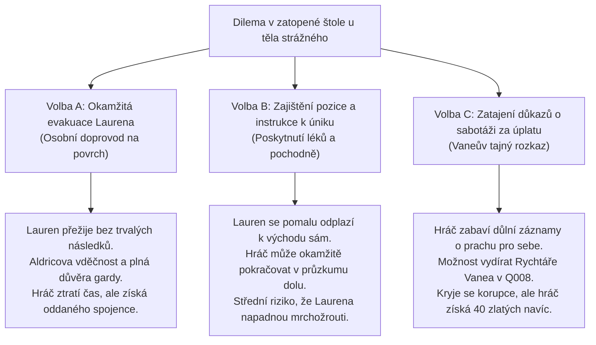

# Q006 – Hlasy z podzemí

> *"Zatloukli jsme portál dubovým trámovím a přibili železné pláty. Ale když přitiskneš ucho ke skále za bezvětrné noci, slyšíš to. Z těch děr vychází hluboké kovové sténání... jako když pod horou dýchá nemocný obr železnými plícemi."*  
> — Desátník městské gardy u západního zátarasu k dolu

---

## Přehled úkolu
S **Císařskou vyšetřovací pečetí** a **Hornickým respirátorem** z [[Q004_PecetAPlamen]] a s **Posvátným rohem** a **Lesní mastí** od elfů z [[Q005_SepotVeVetvich]] je hráč konečně plně vybaven k otevření zapečetěné šachty v [[Opuštěný důl|Opuštěném dole]] (Šachta Železného štítu).

Situace je kritická: Před dvěma dny vyslal [[Strážmistr Aldric]] tříčlennou průzkumnou hlídku mladých gardistů ověřit zprávy o podivném hluku z podzemí. Žádný z nich se nevrátil. Ze škvír mezi trámovím portálu stoupá ledový sirný průvan a venkované hlásí, že ze šachty v noci znějí zkreslené lidské hlasy a volání o pomoc.

V 1. patře dolu (Horní štoly – Valerijský horizont) však na hráče nečeká jen tma. Průrva spodních vod zatopila hlavní spojovací chodbu kalnou břečkou sahající po kolena, ve výdřevách hnízdí slepí jeskynní troglodyti a aetheritový prach způsobuje bez respirátoru prudké křeče v plicích. Hráč musí zprovoznit historickou parní pumpu, zachránit uvězněné muže a proniknout k hlavnímu šachetnímu výtahu.

---

## Zúčastněné postavy & nepřátelé
- **Zadavatelé úkolu:** [[Strážmistr Aldric]] (žádá záchranu svých mužů) a [[Kovář Torben]] (dává technické instrukce k pumpě a výtahu).
- **Uvězněný velitel hlídky:** Strážný Lauren – leží s rozdrcenou nohou za závalem v boční štole s poslední doutnající loučí.
- **Inženýrský odkaz:** Záznamy předáka Hargana – deníkové desky nalezené u pumpy odhalující sabotáž nosných sloupů před šesti měsíci.
- **Nepřátelé:**
  - *Jeskynní troglodyti (Slepí rypáci):* Zmutovaní podzemní humanoidi citliví na světlo a zvuk.
  - *Krystalický skalní pavouk:* Masivní lezoucí predátor číhající na stropě nad zatopenou šachtou.
- **Dotčené lokace:** [[Oakhaven]], [[Opuštěný důl]].

---

## Fáze úkolu (Quest Steps)

```yaml
steps:
  - id: 1
    objective: "Předlož Císařskou pečeť strážným u zátarasu k Opuštěnému dolu"
    location_id: "oakhaven"
    trigger: "interact_barricade"
    narrative: |
      Na západní cestě do hor stojí zátaras ze zaostřených kůlů a řetězů. Dva vystrašení gardisté s těžkými halpartami ustoupí, jakmile spatří červenou voskovou pečeť s orlicí:
      'Máte odvahu, cizinče. Naši tři kluci tam šli před dvěma dny a ven vyšel jen jejich pes s uříznutým obojkem. Ať vás chrání Solarian i všichni svatí.'
    on_complete_flag: "Q006_step1_barricade_passed"

  - id: 2
    objective: "Vstup do Šachty Železného štítu a nasaď Hornický respirátor"
    location_id: "old_mine"
    trigger: "location_arrival"
    narrative: |
      Hráč páčidlem uvolní těžké dubové fošny na portálu dolu. Z temného chřtánu se vyvalí hustý mrak plynů páchnoucí sírou, ozónem a zkaženými vejci.
      Hráč si nasazuje měděnou masku Železného Prahu. Zvuk vlastního dechu se v masce kovově rozléhá, ale aktivní uhlí a šalvěj spolehlivě odfiltrují jedovaté spóry.
    on_complete_flag: "Q006_step2_mine_entered"

  - id: 3
    objective: "Prozkoumej zatopené Horní štoly a zlikviduj hnízdo troglodytů"
    location_id: "old_mine"
    trigger: "combat_encounter"
    narrative: |
      Voda sahá po kolena a na hladině plavou mastná oka a ztrouchnivělé pražce z úzkokolejky. Na stěnách fosforeskují modré krystalické povlaky.
      Z postranních děr vyrazí trojice vyhublých troglodytů s bledou kůží a kostěnými kyji. Zvířata syčí a pokoušejí se hráče stáhnout pod hladinu. Použití karbidového světla nebo louče je dočasně oslepí a dezorientuje.
    on_complete_flag: "Q006_step3_troglodytes_cleared"

  - id: 4
    objective: "Zprovozni parní odvodňovací pumpu v komoře strojníka"
    location_id: "old_mine"
    trigger: "puzzle_steam_pump"
    narrative: |
      Hráč dorazí do klenuté komory, kde stojí monumentální mosazný parní stroj z Železného Prahu. Kotel je chladný a hladina vody blokuje přístup k výtahu.
      Úkol vyžaduje minihru:
      1. Otočit třemi tlakovými ventily v pořadí: Voda -> Pára -> Výpust.
      2. Zapálit uhlí v topeništi pomocí křesadla a oleje z výbavy.
      3. Nahodit setrvačník těžkou pákou.
      Stroj s mohutným zakašláním ožije, písty začnou rytmicky tepat a hladina v chodbách začne se syčením klesat.
    on_complete_flag: "Q006_step4_pump_running"

  - id: 5
    objective: "Lokalizuj uvězněnou hlídku a zachraň zraněného strážného Laurena"
    location_id: "old_mine"
    trigger: "interact_survivor"
    narrative: |
      Po odčerpání vody se odhalí vchod do zavalení boční štoly. Hráč nachází těla dvou padlých gardistů a živého strážného Laurena, který má nohu přimáčknutou těžkým trámem.
      Hráč uvolní trám páčidlem a ošetří Laurenův otevřený šrám Lesní pryskyřičnou mastí (z Q005), která okamžitě zastaví krystalickou otravu krve.
      Lauren vděčně předá starou mapu a šeptá: 'Zával... nebyl náhoda. Našel jsem na trámech stopy po vrtácích a valerijském střelném prachu... někdo nás tu chtěl pohřbít zaživa.'
    on_complete_flag: "Q006_step5_lauren_rescued"

  - id: 6
    objective: "Doraž k hlavní šachtě a zajisti Páku parního výtahu a Geologický kompas"
    location_id: "old_mine"
    trigger: "loot_elevator_platform"
    narrative: |
      Na konci hlavní chodby se otevírá obrovský podzemní dóm. V propasti zeje černota, kterou protínají silná pletená ocelová lana. Masivní klec těžního výtahu visí na úrovni patra, ale její ovládací konzole je vyrvaná.
      V rozbité skříňce dozorce nachází hráč masivní litinovou páku výtahu a v koženém pouzdře funkční Geologický kompas Železného Prahu, jehož střelka divoce vibruje směrem k hlubinám.
    on_complete_flag: "Q006_step6_lever_secured"
```

---

## ⚖️ Morální Rozhodnutí: Osud Zraněného Laurena a Utajení Sabotáže

Při záchraně strážného Laurena stojí hráč před zásadní volbou:



### Dlouhodobé dopady volby:
* **Záchrana Laurena (Cesta cti):** Lauren je synem borisova souseda v Oakhaven. Jeho návrat domů zvedne morálku v městečku a v [[Q008_PredvecerKatastrofy]] bude svědčit před městskou radou o tom, co v dole viděl, čímž definitivně zlomí Kaelenovu snahu obvinit bylinkářku.
* **Pragmatické utajení (Cesta intrik):** Deník předáka Hargana s důkazy o koupi trhacího prachu markrabětem Leopoldem je cennou zbraní. V Aktu 2 umožní hráči vydírat lenního pána na Falkenwachtu.

---

## 💬 Ukázky Klíčových Dialogů

### 1. Záchrana zraněného Laurena v zavalení
> **Strážný Lauren (třepe se chladem, obličej šedý od prachu):**  
> *"Solariane... smiluj se... nemyslel jsem, že ještě někdy uvidím lidskou tvář. Kluci... Tom a Vane... jsou mrtví. Něco je stáhlo do vody, než jsem stačil vystřelit z kuše... Ta noha... necítím v ní prsty. Prosím tě, nenechávej mě tu potkanům!"*  
> 
> **Možnosti hráče:**
> 1. *(Léčení & Soucit)* „Utiš se, chlapče. Mám mast od elfí šamanky a Míry. Tady, napij se pálenky. Trám zvednu páčidlem. Půjdeme odsud spolu, i kdybych tě měl k východu odnést na zádech.“ *(Hod na Sílu & Použití Lesní pryskyřičné masti)*
> 2. *(Pragmatické ošetření)* „Zastavil jsem ti krvácení a nohu ti svážu dlahou. Tady máš nabitou kuši a karbidovou lampu. K pumpě je to sto kroků a voda už opadla. Musím zajistit ovládání výtahu, jinak to odsud neodpálíme. Doplazíš se k portálu sám?“ *(Hod na Přežití)*
> 3. *(Výslech o sabotáži)* „Nejdřív mi řekni, co jsi tam viděl, Laurene. Říkal jsi něco o trhacím prachu. Kdo ty sloupy odpálil?“ *(Hod na Vyšetřování)*

---

### 2. Rozbor situace u výtahu s Kovářem Torbenem (přes přenosnou rouru)
> **Kovář Torben (hlas duní z ventilační trouby):**  
> *"Slyšíš mě tam dole, mladej?! Jestli pumpa klape, máš vyhráno napůl! Klec výtahu drží na protizávažích ze surového olova. Bez ovládací páky s ním nepohne ani stádo volů! Najdi tu páku a zkontroluj závěsná lana. Druhé patro patřilo našim kovářům – tam jsme před závalem kovali olověnou schránu pro jádro!"*

---

## 🎒 Získané Klíčové Předměty (Fyzické Artefakty)

V naprostém souladu s pravidly světa hráč **nezískává žádné magické schopnosti**, nýbrž těžké kované nástroje a průzkumnou techniku:

1. ⚙️ **Páka parního výtahu (Elevator Control Lever):**
   - Čtyřicet centimetrů dlouhá masivní ocelová rukojeť s ozubeným tisícihranem a bezpečnostní západkou.
   - **Využití:** Zasazuje se do ovládacího pultu v šachetním dómu. Umožňuje sjet klecí výtahu do 2. patra (*Dílna Železného Prahu*) a 3. patra (*Zapečetěná žíla*) v úkolu [[Q007_ZtracenaKomora]].
2. 🧭 **Geologický kompas Železného Prahu:**
   - Mosazné pouzdro se skleněným průzorem, v němž plave na rtuti jemná krystalická střelka.
   - **Využití:** Střelka se natáčí za vibracemi Aetheritu. Umožňuje hráči detekovat nestabilní stěny hrozící závalem a odhalovat tajné rudné dutiny v podzemí.
3. 🪔 **Kahan s modrým sklem (Bezpečné důlní světlo):**
   - Hermeticky uzavřená karbidová svítilna se síťkou Humphryho Davyho. Nevznítí třaskavé důlní plyny a její modrý filtr umožňuje vidět skryté luminiscenční stopy troglodytů.

---

## 🔗 Návaznost na další úkoly v Aktu 1
- **Přímé odemčení:** [[Q007_ZtracenaKomora]] – Sestup výtahem do 2. patra dolu, odemčení staré prachárny kovářů mosazným klíčem (z Q003) a zisk *Olověné schrány na jádro*.
- **Související vedlejší úkol:** [[Q104_PosledniZasilka]] – Možnost najít ostatky pohřbených tovaryšů v zatopených chodbách a doručit jejich pečetní známky Torbenovi.
- Aktualizován stav v souborech: [[Act1_Oakhaven|Akt 1: Údolí Oakhaven]] a [[Atlas_Udoli_Oakhaven|Atlas údolí Oakhaven]].
