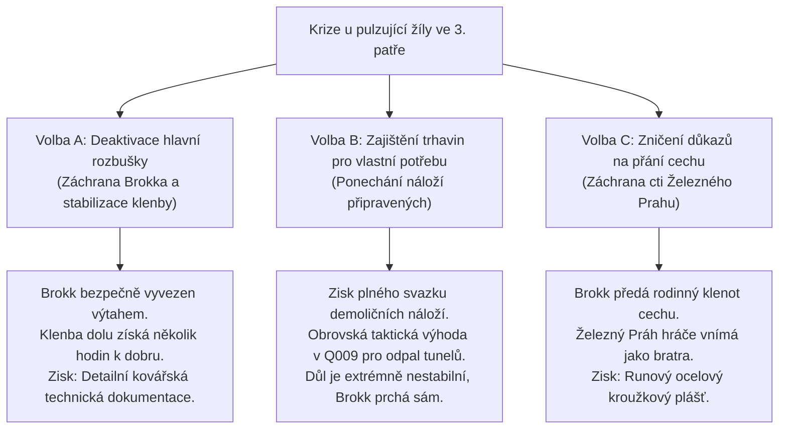

# Q007 – Ztracená komora kovářů

> *"Když naši kovářští předci v Železném Prahu poprvé narazili na pulzující srdce hory, nepadli na kolena a nezačali se modlit k nebesům. Vzali chladnou ocel, surové olovo a řetězy a spoutali ho tak pevně, že ani tisíc let ho nemělo probudit. Kdo ty pečetě zlomil, nechtěl jen kamení. Chtěl zbraň, která spálí svět."*  
> — Prastarý nápis vytesaný runami Železného Prahu do bronzových vrat 3. patra

---

## Přehled úkolu
S *Pákou parního výtahu* zprovozněnou v [[Q006_HlasyZPodzemi]] sjíždí hráč po skřípajících ocelových lanech do hlubin, kam lidská noha nevkročila od tragického závalu před šesti měsíci.

- **2. patro (Dílna Železného Prahu):** Monumentální podzemní slévárna vysekaná v černé žule. Obří parní buchary stojí ztichlé pod nánosy sazí, v tavicích pecích zkameněla struska a ve stínech se míhají krystalické anomálie. Zde hráč využije *Mosazný klíč* získaný na křižovatce v [[Q003_ZlomenaPrisaha]] k otevření opevněného kovářského trezoru.
- **3. patro (Zapečetěná žíla & Kovářská krypta):** Nejhlubší dno světa. Zde se skalní stěny rozestupují do obří jeskyně, v jejímž středu pulzuje surová aetheritová žíla oslepujícím azurovým světlem.

Hráč zjišťuje děsivou pravdu: žíla byla před staletími uzavřena do krunýře z hydraulických pístů a olověných desek. Někdo však hydrauliku úmyslně přeťal a na nosné pilíře umístil těžké prachové nálože s časovými zápalnicemi. Mezi stroji obchází pološílený důlní dozorce – kdysi hrdý mistr z Železného Prahu, nyní krystalický berserker s tělem znetvořeným prorůstajícím modrým nerostem.

Hráč musí berserkra přemoci, zajistit jedinou existující transportní schránu schopnou pojmout Aetheritové jádro, zneškodnit část rozbušek a získat důkaz o tom, kdo z povrchu dal příkaz k této zkáze.

---

## Zúčastněné postavy & nepřátelé
- **Dálkový spojenec & rádce:** [[Kovář Torben]] – přes ventilační šachtu navádí hráče k tajnému mechanismu trezoru.
- **Tragický Boss patra:** *Zkrystalizovaný dozorce Hargan* – bývalý velitel těžby; z jeho páteře a paží vyrůstají ostré modré krystaly, v rukou třímá obouruční těžařské kladivo.
- **Přeživší tovaryš v úkrytu:** Raněný trpaslík Brokk – ukrytý v prázdném kotli na páru, svědek sabotáže.
- **Dotčené lokace:** [[Opuštěný důl]] (2. a 3. patro).

---

## Fáze úkolu (Quest Steps)

```yaml
steps:
  - id: 1
    objective: "Nasaď Páku parního výtahu a sjeď do 2. patra dolu (Dílna Železného Prahu)"
    location_id: "old_mine"
    trigger: "interact_elevator"
    narrative: |
      Zasazuješ masivní páku do ozubené skříně. Ozve se skřípavé zaklapnutí západky, ocelová lana se napnou a klec výtahu se s trhnutím propadne do temnoty.
      Klec zastavuje v monumentálním sále. Všude leží vyhaslé tavicí pece a parní buchary obrostlé modrými mechy. Ve vzduchu je cítit těžký kovový pach a chladné jiskření Aetheritu.
    on_complete_flag: "Q007_step1_elevator_descended"

  - id: 2
    objective: "Odemkni kovářský trezor mosazným klíčem z Q003 a zajisti Olověnou schránu"
    location_id: "old_mine"
    trigger: "loot_dwarven_vault"
    narrative: |
      V zadní části dílny nacházíš masivní bronzová vrata se znakem kladiva a kovadliny. Mosazný klíč z těla kurýra na křižovatce přesně zapadá do trojitého zámku.
      Uvnitř trezoru na kamenném podstavci leží Kovaná olověná schrána Železného Prahu. Je těžká jako balvan, její stěny jsou silné dva palce a vnitřek je vylitý tekutým stříbrem. Je to jediný kontejner v údolí, který dokáže odstínit smrtící záření aetheritového jádra.
    on_complete_flag: "Q007_step2_lead_container_secured"

  - id: 3
    objective: "Sestup puklinou do 3. patra a prozkoumej Zapečetěnou žílu"
    location_id: "old_mine"
    trigger: "location_arrival"
    narrative: |
      Podle kmitající střelky Geologického kompasu sestupuješ přírodní břidlicovou puklinou na samé dno dolu.
      Dóm pod tebou bere dech: uprostřed jeskyně pulzuje gigantická žíla čistého Aetheritu. Zářící krystaly osvětlují obří ocelové torzo spícího těžařského stroje – Aetheritového kolosa.
      Z pilířů kolem visí odpalovací šňůry napojené na soudky s valerijským trhacím prachem.
    on_complete_flag: "Q007_step3_vein_entered"

  - id: 4
    objective: "Poraz Zkrystalizovaného dozorce Hargana v souboji u žíly"
    location_id: "old_mine"
    trigger: "combat_boss"
    narrative: |
      Ze stínů za nohama kolosa vyrazí monstrum. Dozorce Hargan ztratil rozum i lidskou podobu – krystaly mu prorostly lebkou a kůží.
      Boss má dvě fáze:
      1. Kladivové údery: Hargan buší do země a vyvolává padání kamení ze stropu.
      2. Krystalická erupce: Při polovičních životech vypustí vlnu modrého žáru. Hráč musí využít Hornický respirátor a Lesní mast, aby nepodlehl otravě, a udeřit do nechráněného týlu, kde krystaly ještě neprorostly.
    on_complete_flag: "Q007_step4_boss_defeated"

  - id: 5
    objective: "Vyslechni ukrytého tovaryše Brokka a získej Mechanický klíč 'Sluneční ozub'"
    location_id: "old_mine"
    trigger: "interact_npc:brokk"
    narrative: |
      Z prázdného kotle vyleze třesoucí se tovaryš Brokk. Předá hráči masivní bronzové ozubené kolo – 'Sluneční ozub', který vytrhl z hydrauliky kolosa:
      'Hargan zešílel, když dorazil ten chlap z povrchu. Přivezl vozy s prachem a tvrdil, že má rozkaz od městské rady z Oakhaven! Chtěli jádro vyrvat za každou cenu! Tady... vzal jsem tenhle klíč, bez něj kolos nemůže plně sepnout své parní komory!'
    on_complete_flag: "Q007_step5_brokk_testimony"

  - id: 6
    objective: "Zajisti zbytky odpalovacího mechanismu a svazek odpalovacích šňůr"
    location_id: "old_mine"
    trigger: "loot_sabotage_evidence"
    narrative: |
      Hráč opatrně odřezává hořící zápalnice ze tří prachových soudků u hlavního nosného pilíře.
      Na dřevěném pouzdře roznětky nachází vyraženou císařskou celní pečeť a podpis vystavený v městském archivu Oakhaven. Sabotér je přímo ve městě.
    on_complete_flag: "Q007_step6_evidence_secured"
```

---

## ⚖️ Osud Tovaryše Brokka a Záchrana Hlubin

Po boji s Harganem musí hráč učinit rozhodnutí ohledně zraněného trpaslíka a nastražených náloží:



### Podrobné dopady voleb:
* **Volba A (Stabilizace & Záchrana):** Brokk potvrdí před Torbenem v Oakhaven, že hráč jednal jako pravý spojenec. Torben pro hráče v [[Q008_PredvecerKatastrofy]] připraví vylepšené kalené hroty do kuše a zápalné směsi.
* **Volba B (Zajištění trhavin):** Hráč má v inventáři *Svazek důlních odpalovacích šňůr*. V závěru [[Q009_NocZlomenehoSlunce]] tato volba přímo odemyká možnost **Odpálení přístupových tunelů (Volba A ve finále)**, což zachrání Oakhaven před celkovým zničením.
* **Volba C (Cechovní přísaha):** Hráč slíbí, že utají Harganovo šílenství, aby nepošpinil pověst cechu před císařskou inkvizicí. Železný Práh hráči poskytne diplomatickou imunitu v Aktu 2.

---

## 💬 Ukázky Klíčových Dialogů

### 1. Poslední slova zmutovaného dozorce Hargana
> **Dozorce Hargan (umírá u paty kolosa, modré světlo z jeho očí pomalu pohasíná):**  
> *"Oheň... už ho necítím. Ty jsi... z povrchu? Pověz Torbenovi... že jsem se snažil. Přišli v noci. Měli papíry se zlatou orlicí... myslel jsem, že je to rozkaz z paláce. Ale oni chtěli jen probudit kolosa... chtěli vidět, jak země pukne. Běž... utíkej nahoru... ten oheň už nikdo nezastaví..."*

---

### 2. Rozhovor s tovaryšem Brokkem u trezoru
> **Tovaryš Brokk (třesoucíma se rukama podává olověnou schránu):**  
> *"Tady je. Půl roku jsem na ní spal v tom kotli. Kována z olova ze Sedmi štítů, zevnitř vymazaná tekutým stříbrem. Pokud to jádro vyrveš ven bez téhle bedny, spálí ti maso z kostí na deset kroků dřív, než stačíš mrknout. Vem si ji. A vem si i tenhle ozub... bez něj kolos neotevře hrudní plát."*

---

## 🎒 Získané Klíčové Předměty (Fyzické Relikvie)

V souladu se standardem světa Aelthgard hráč **nezískává žádné magické skilly**, ale čistě mechanické a technologické komponenty Železného Prahu:

1. 🛡️ **Kovaná olověná schrána Železného Prahu (Lead Core Container):**
   - Monumentální, padesátikilová olověná truhla s hermetickým šroubovým uzávěrem a stříbrnou výstelkou.
   - **Využití:** Absolutně nezbytná rekvizita pro finále Aktu 1 ([[Q009_NocZlomenehoSlunce]]). Pouze do této schrány lze uzamknout surové Aetheritové jádro. Hráč ji v Aktu 2 nese jako ústřední McGuffin celého příběhu.
2. ⚙️ **Mechanický klíč 'Sluneční ozub' (Sun-Cog Bypass Key):**
   - Těžké bronzové ozubené kolo se sedmi zářezy a rukojeťovým trnem.
   - **Využití:** V souboji s Aetheritovým kolosem v Q009 umožňuje hráči vyšplhat na konstrukci a mechanicky vypnout chlazení, čímž odhalí jádro k vytržení.
3. 🧨 **Svazek důlních odpalovacích šňůr (Mining Fuse & Blasting Caps):**
   - Válečky lisovaného černého prachu a dehtu s rychlopalnými doutnáky.
   - **Využití:** Zbraň těžkého kalibru nebo nástroj k odpálení přístupových tunelů v závěru Aktu 1.

---

## 🔗 Návaznost na další úkoly v Aktu 1
- **Přímé odemčení:** [[Q008_PredvecerKatastrofy]] – Hráč se vrací do Oakhaven konfrontovat sabotéra na základě celní pečeti a dopisů z dolu.
- Aktualizován stav v souborech: [[Act1_Oakhaven|Akt 1: Údolí Oakhaven]] a [[Atlas_Udoli_Oakhaven|Atlas údolí Oakhaven]].
