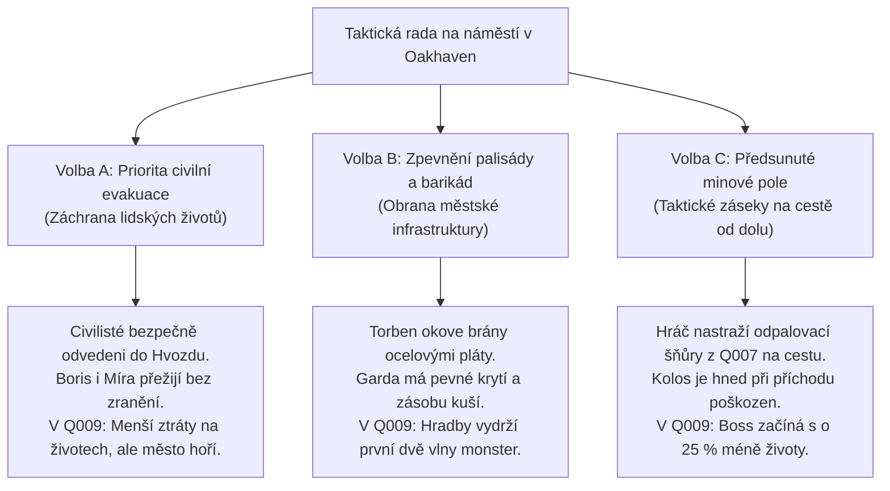

# Q008 – Předvečer katastrofy

> *"Není to běsnění přírody ani náhodné neštěstí, pane. Byla to chladná, zvrácená účetní kalkulace. Markrabě dlužil miliony lichvářům v přístavech. Chtěli žílu naříznout a jádro vyrvat dřív, než do údolí dorazí císařští výběrčí. Ale ta věc pod zemí není hloupé stříbro... probudili něco, co se nedá koupit ani uplatit."*  
> — Písař Kilián, přistižený v suterénu městského archivu s hořícím pergamenem

---

## Přehled úkolu
Důkazy zajištěné v kovářské kryptě 3. patra dolu ([[Q007_ZtracenaKomora]]) vedou přímo do srdce [[Oakhaven]]. Celní pečetě z odpalovacích náloží jasně dokazují, že zával a sabotáž nespáchal žádný vnější nájezdník, nýbrž místní úřední aparát jednající na tajný rozkaz lenního pána [[Rod Falkenů - Páni Pohraničí|markraběte Leopolda von Falken]] a překupníků ze [[Svobodná města]].

Když se hráč s těžkou *Olověnou schránou* vrací na povrch, údolí již zachvacuje předzvěst kataklyzmatu:
- Pod nohama se v nepravidelných intervalech chvěje zem a z hlubokých puklin v dlažbě stoupá horká modravá pára.
- Voda v řece Oak u [[Starý mlýn|Starého mlýna]] se zbarvila do šedého bahna a ryby plavou břichem vzhůru.
- Obloha nad pohořím Železného štítu má nepřirozený, jedovatě fialový odstín a ptáci zcela ztichli.

Hráč musí v zoufalém závodě s časem konfrontovat spiklence na radnici, získat odpalovací diagram šachet a připravit městečko na nevyhnutelný úder dřív, než hlubinný přetlak roztrhne skalní masiv a probudí *Aetheritového kolosa*.

---

## Zúčastněné postavy & mocenské střety
- **Velitel obrany:** [[Strážmistr Aldric]] – organizuje narychlo svolanou domobranu a staví barikády na západní přístupové cestě.
- **Odhalený zrádce:** [[Rychtář Vane]] a písař Kilián – pokoušejí se spálit kompromitující účetní knihy a uprchnout s truhlami zlata zadní brankou.
- **Technický poradce:** [[Kovář Torben]] – studuje odpalovací diagram a připravuje nouzové rozbušky k odstřelu tunelů.
- **Duchovní hrozba:** [[Inkvizitor Kaelen]] – odmítá evakuaci měšťanů a shromažďuje fanatické poutníky k polední modlitbě u Pařezu Pradubu, přesvědčen, že sluneční víra město spasí.
- **Civilní oběti:** [[Boris Mlynář]] a [[Bylinkářka Míra]] – připravují obvazy a evakuaci raněných ze spodní čtvrti.

---

## Fáze úkolu (Quest Steps)

```yaml
steps:
  - id: 1
    objective: "Vrať se z Opuštěného dolu do Oakhaven a spoj se se Strážmistrem Aldricem"
    location_id: "oakhaven"
    trigger: "location_arrival"
    narrative: |
      Dlažba na náměstí se pod nohama vlní jako paluba lodi v bouři. Ze studny v Pařezu Pradubu tryská vroucí voda a pach síry je nesnesitelný.
      Aldric stojí na schodech radnice s taseným mečem: 'Země puká, z dolu se valí modrý dým a rychtář se zamkl v archivu a pálí knihy! Řekni mi, co jsi tam dole našel!'
    on_complete_flag: "Q008_step1_aldric_briefed"

  - id: 2
    objective: "Vylom dveře městského archivu a konfrontuj spiklence"
    location_id: "oakhaven_townhall"
    trigger: "interact_archive_door"
    narrative: |
      Hráč vyrazí kované dveře do sklepení radnice. V klenutém sále je plno kouře. Rychtář Vane a písař Kilián horečně hází svazky listin do rozpáleného krbu.
      Když spatří olověnou schránu a důlní pečetě v hráčových rukou, Vane klesne na kolena v slzách: 'Neměli jsme na vybranou! Falkenwacht byl zadlužený až po střechu... slíbili nám podíl z prodeje jádra syndikátu v Novém Přístavu!'
    on_complete_flag: "Q008_step2_conspirators_cornered"

  - id: 3
    objective: "Vyslechni Vanea a zajisti Odpalovací diagram dolu a Tajný dopis syndikátu"
    location_id: "oakhaven_townhall"
    trigger: "dialogue_choice:interrogate_vane"
    narrative: |
      Vane vytahuje zpoza gobelínu železnou kazetu a s třesoucíma se rukama ji předává:
      'Tady je všechno... technické plány šachet, slabá místa nosné klenby i smlouva s pečetí konsorcia Svobodných měst. Ale vy to nechápete! Ten odpal se nezdařil – místo aby žílu odštípli, prorazili chladicí komoru té staré císařské konstrukce! Kolos do sebe natáhl všechnu energii a hrabe se nahoru!'
    on_complete_flag: "Q008_step3_evidence_confiscated"

  - id: 4
    objective: "Zvol taktickou přípravu městečka na nevyhnutelný útok"
    location_id: "oakhaven"
    trigger: "tactical_choice:town_defense"
    narrative: |
      Aldric, Torben a Míra čekají u městské kašny. Do erupce zbývají desítky minut. Hráč musí rozhodnout, kam napnout veškeré zbývající síly Oakhaven.
    on_complete_flag: "Q008_step4_tactics_chosen"

  - id: 5
    objective: "Odemkni tajnou únikovou branku v palisádě pro evakuaci civilistů"
    location_id: "oakhaven_herbalist"
    trigger: "unlock_escape_gate"
    narrative: |
      Hráč předává Klíč od tajné branky Bylinkářce Míře a Borisovi. Malá dubová vrátka v zadní části palisády za bylinkářskou chýší vedou přímo na skrytou lesní stezku do Temného hvozdu.
      První ženy, děti a starci začínají v tichu prchat z ohroženého městečka.
    on_complete_flag: "Q008_step5_civilians_evacuated"

  - id: 6
    objective: "Zažij kataklyzmatický zlom: Erupce v dole a probuzení Kolosa"
    location_id: "oakhaven"
    trigger: "cutscene_event:cataclysm_eruption"
    narrative: |
      Vteřiny před půlnocí se čas zastaví. Z hloubi hor zazní zvuk, jako když praskne obří ocelová struna.
      Horský hřeben nad Opuštěným dolem exploduje. Do nebe vytryskne padesátimetrový gejzír oslepujícího azurového světla, který ozáří celé údolí jako v pravé poledne. Tlaková vlna smete stromy, v Oakhaven praskají okna a hráz u Starého mlýna se s ohlušujícím rachotem bortí.
      Ze zvedajícího se mraku prachu a jisker na úpatí hory se tyčí dvanáctimetrová silueta Aetheritového kolosa.
    on_complete_flag: "mine_sabotage_triggered"
```

---

## ⚖️ Zásadní Taktická Volba: Příprava na Úder

Před vypuknutím katastrofy musí hráč určit, jak Oakhaven využije své poslední zásoby a čas:



### Podrobný rozbor taktických variant:

#### 🏃 Volba A: Priorita civilní evakuace (Záchrana duší)
* **Rozhodnutí:** Hráč nařídí okamžité vyklizení spodní čtvrti a soustředí gardu na doprovod civilistů k tajné brance do [Temného hvozdu](file:///C:/Users/janml/.gemini/antigravity/RPGprojectHonza/Aelthgard/%F0%9F%93%8D%20Locations/Temn%C3%BD%20hvozd.md).
* **Následky:**
  - Všichni klíčoví měšťané (Boris Mlynář, bylinkářka Míra, děti a ranění) bezpečně uniknou do péče elfů.
  - V městečku zůstane jen hrstka obránců, což ztíží první fázi obrany v [[Q009_NocZlomenehoSlunce]].
* **Speciální bonus:** *Požehnání vděčných uprchlíků* (+20 reputace u Oakhaven, Sylwen hráči v Q009 bez váhání pošle elfí lučištníky).

#### 🛡️ Volba B: Zpevnění palisády (Pevnost Oakhaven)
* **Rozhodnutí:** Hráč a Torben využijí veškeré ocelové traverzy a zásoby ze zbrojnice ke zpevnění západní brány a vybudování dvojitých zátarasů.
* **Následky:**
  - Palisáda bezpečně udrží nápor zmutovaných vlků a troglodytů v krocích 1 a 2 v [[Q009_NocZlomenehoSlunce]].
  - Část civilistů však uvízne v domech a bude potřebovat záchranu během požáru.
* **Speciální bonus:** *Obrněné postavení gardy* (Aldric a jeho gardisté mají v Q009 dvojnásobnou odolnost a pálí salvami zápalných šipek).

#### 💣 Volba C: Předsunuté minové pole (Taktická léčka)
* **Rozhodnutí:** Hráč využije *Svazek odpalovacích šňůr* (z Q007) a sudy s prachem ze zbrojnice a nastraží na přístupovou cestu od dolu masivní řetězovou past.
* **Následky:**
  - Jakmile Aetheritový kolos vyrazí k městu, projde minovým polem. Výbuch mu utrhne levou hydraulickou vzpěru nohy.
  - V bossfightu v [[Q009_NocZlomenehoSlunce]] je kolos pomalejší, nemůže používat dupnutí o zem a začíná souboj s citelně sníženým zdravím.
* **Speciální bonus:** *Taktická výhoda demoličního mistra* (okamžité zničení první vlny monster jedním odpalem).

---

## 💬 Ukázky Klíčových Dialogů

### 1. Konfrontace s Rychtářem Vaneem v radničním archivu
> **Rychtář Vane (tiskne k hrudi ohořelou knihu pohledávek):**  
> *"Myslíte si, že jsem zrůda, co?! Zkuste se na pět minut posadit na mou židli! Císařský dvůr z nás sedře kůži, když nezaplatíme desátky! Markrabě Leopold mi poslal jasný vzkaz: 'Buď dodáš Aetherit syndikátu ze Svobodných měst, nebo zítra skončíš na šibenici na Staré křižovatce!' Chtěl jsem jen zachránit město před hladem a popravami!"*  
> 
> **Možnosti hráče:**
> 1. *(Spravedlnost & Odpor)* „Zachránit město? Podívej se z okna, Vane! Půda pod tvou radnicí puká vejpůl a řeka vaří ryby zaživa! Za tvoje zlaťáky dnes v noci zaplatí stovky nevinných lidí!“ *(Předání Vanea do vazby Aldricovi)*
> 2. *(Chladný pragmatismus)* „Tvoje výmluvy mě nezajímají. Dej mi odpalovací diagram a klíč od zadní branky. Pokud mi pomůžeš zachránit lidi, možná tě Aldric nepověsí hned na první větvi.“ *(Získání klíčů bez násilí)*
> 3. *(Vydírání pro budoucnost)* „Ten dopis s pečetí syndikátu si nechám. Až tohle peklo skončí, markrabě na Falkenwachtu se mnou bude mluvit velmi zdvořile. Zmiz odsud, než tě nechám sežrat troglodytům.“ *(Zabavení tajného dopisu)*

---

### 2. Závěrečná porada před kataklyzmatem (Aldric & Torben)
> **Strážmistr Aldric (utahuje si kožený řemen na štítu):**  
> *"Pokud ta skála praskne celá, budeme mít na krku nejen tu věc z dolu, ale všechno, co v lesích žije a bojí se světla. Chlapče... nevím, kdo tě do tohohle údolí poslal. Ale jestli existuje nějaký bůh, který se na nás dnes dívá, ať stojí při tvé čepeli."*

---

## 🎒 Získané Klíčové Předměty (Fyzické Artefakty)

V naprostém souladu s lore světa Aelthgard hráč **nezískává žádné magické schopnosti**, ale strategické mapy, klíče a usvědčující listiny:

1. 🗺️ **Odpalovací diagram dolu (Mine Demolition Blueprint):**
   - Velký rýsovaný plán na voskovaném plátně zobrazující přesné polohy nosných pilířů, přívodních šachet a slabin klenby Šachty Železného štítu.
   - **Využití:** Klíčová taktická mapa pro finále [[Q009_NocZlomenehoSlunce]]. Umožňuje hráči přesně umístit nálože pro **Volbu A (Odpálení tunelů)** a bezpečně zavalit kolosa.
2. ✉️ **Zabavený dopis syndikátu Svobodných měst:**
   - Dopis na hedvábném papíře s pečetí Obchodní ligy z Nového Přístavu adresovaný markraběti Leopoldu von Falken. Potvrzuje vyplacení 50 000 dukátů za dodání funkčního aetheritového artefaktu.
   - **Využití:** Ústřední politická zbraň pro **Akt 2**. Umožňuje hráči vydírat lenní pány a odhaluje pašerácké trasy vedoucí z údolí.
3. 🗝️ **Klíč od tajné únikové branky Oakhaven:**
   - Těžký mosazný klíč od zadní únikové branky v palisádě u bylinkářské chýše.
   - **Využití:** Odemkne záchrannou trasu do hvozdu, kterou v Q008 uniknou civilisté a v závěru Q009 sám hráč po pádu městečka.

---

## 🔗 Návaznost na Vyvrcholení Aktu 1
- **Přímé spuštění:** Nastavením flagu `mine_sabotage_triggered` se okamžitě spouští **EPICKÉ FINÁLE AKTU 1:** [[Q009_NocZlomenehoSlunce]].
- Hráč vstupuje do finále se všemi nashromážděnými nástroji:
  - *Annin runový prsten* (Q001)
  - *Stínový pečetní kámen* (Q002)
  - *Císařská pečeť & Respirátor* (Q004)
  - *Vyřezávaný roh z tisu* (Q005)
  - *Geologický kompas* (Q006)
  - *Olověná schrána & Sluneční ozub* (Q007)
  - *Odpalovací diagram & Únikový klíč* (Q008)
